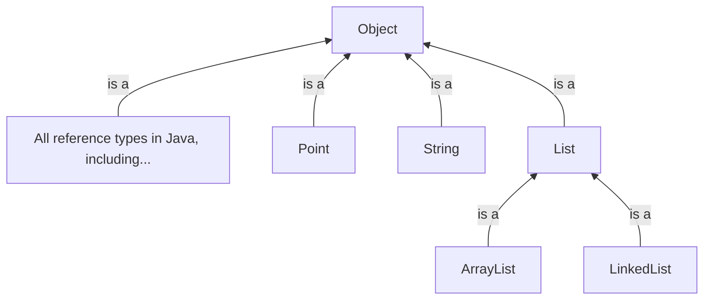

# Interfaces

> In this lesson, we'll learn:
> * About interfaces, the general concept.
> * About `interface`s, the embodiment of that concept in the Java language.
> * About how they are useful, using lists as an example.
> * About the meaning of **polymorphism**.

## What is an interface?

> **PONDER**
>
> What does the word "interface" mean to you?

You may have heard the term in various contexts.
For example, a graphical user interface (GUI) is the "frontend" that a computer application presents to the user, usually with buttons to click, text or images on screen, and information dialogues to convey information.

An *interface* is the surface at which two systems interact.
A *system* here can be a person, an organization, a computer systems, etc.

For example, consider the file system on your computer.
You have data on your computer organised into a hierarchy of files and folders.
You can interact with this file system using your operating system's file explorer GUI, e.g., the **Finder** app in macOS.
What you can do is dictated by the behaviours exposed by the interface.
That is, you can drag-and-drop files to move them, you can right-click on files or folders to copy, paste, rename, or delete them, and so on.


You can also interact with the *same* underlying system using another interface: the command line.
The command line exposes the same behaviours and more — again, what you can accomplish is determined by the behaviours exposed by the interface.


In both cases, the interfaces above hide many details from you, the user, like the actual organisation of bits and bytes on disk, the permissions system that dictates who can see or use what files, etc.

Those interfaces are the *surface* at which the two systems—the user and the file system—interact with each other. Similarly, classes in Java (or, more generally, modules in software systems) expose behaviours that other classes or modules can use to interact with them.

### We've already seen interfaces in action

Though there is an `interface` keyword and program construct in Java, we aren't talking about that just yet.

Even though we haven't used that word explicitly, we've already been thinking about interfaces.
When we create classes in Java, we tend to make our instance variables `private` and we make most of our instance methods `public`.
This is us defining the "public surface" of our class, or the "public surface" that instances of that class will expose to other classes that want to interact with them.

The "public surface" here would include:

- **Method signatures for the public instance methods**. I.e., their names, return types, and parameter types. These three give a sense of what the method does, what inputs it expects, and what outputs it will give back.
- **Documentation**. Often, there is more detail needed to describe a method's purpose. E.g., simply knowing that a method returns an `int` doesn't necessarily tell us much about what that `int` means. There may be preconditions without which the method would not work as expected. There may be postconditions, i.e., effects that method will have that are not necessarily reflected in the returned value (for example, a setter method that mutates an object's state). So we also write documentation that accompanies every public method.[^javadoc]

[^javadoc]: The exact format of that documentation is quite simple and beyond the scope of this lesson. Documentation in Java is written in a format that can be understood by a tool called JavaDoc. JavaDoc can read your comments and generate a web-page containing documentation. For example, [this ArrayList documentation](https://docs.oracle.com/en/java/javase/21/docs/api/java.base/java/util/ArrayList.html) was generated by JavaDoc based on the comments in [this Java file](https://github.com/openjdk/jdk/blob/master/src/java.base/share/classes/java/util/ArrayList.java). Here is a [nice concise overview of the JavaDoc format](https://www.baeldung.com/javadoc)

In sum:

> The interface of a class exposes *what* the class does, but not *how* it does it.

## Interfaces in Java

The `interface` keyword in Java takes this principle and makes it a language-level construct.
An `interface` is a type of limited `class`. Unlike a class,

- An `interface` **declares** instance methods, but does not **define** them. That is, it only specifies method signatures, and nothing else.[^default]
- An `interface` cannot declare instance variables. This makes sense from two perspectives.
  - First, if the `interface` dictated the available instance variables, it's straying closer to saying *how* things should be done, i.e., implementation details. This is not the goal of interfaces.
  - Second, with no method definitions, there wouldn't be much use for those instance variables.
- An `interface` cannot have constructors, nor can it have any data or behaviour. So, unlike a `class`, an `interface` cannot be used as a blueprint from which to create objects.
- An `interface` **_can_** have `static` variables and `static` methods.

> **PONDER**
>
> Why do you think it's okay for `interface`s to have `static` members? Why do you suppose that would be useful?

[^default]: This is a temporary simplification. We'll talk about `default` methods in the next lesson. If you already know about them, allow me this sin of omission for the time being.

By omitting all implementation details—like instance variables, and the bodies (definitions) of instance methods—the `interface` takes the "skeleton" of what a class should be able to do, and places that in a separate Java file.

Then, you can write a separate Java class that *implements* an interface by providing implementations for the methods that the `interface` declared.
That class can have whatever instance variables it needs for its implementations.

> Just like a `class` can be used as a blueprint from which to create objects, and `interface` is a blueprint for a `class`.

Let's look at some examples!

### A data structures example: Lists

Consider the **List** data structure.
I don't mean lists in any particular programming language—I just mean the [abstract notion](https://opendsa-server.cs.vt.edu/ODSA/Books/Everything/html/ADT.html) of a list.
Abstractly, we expect lists to support the following basic operations:

* `get(index): Object`: We should be able to get the item at the specified index.
* `add(item)`: We should be able to add an item to the back of the list.
* `add(index, item)`: We should be able to add an item to the specified index in the list.
* `remove(item): boolean`: We should be able to remove the specified item from the list, and tell the user if something was removed or not.
* `remove(index): Object`: We should be able to remove an item from a specified index in the list, and return the item that was removed.
* `contains(item): boolean`: We should be able to check if the list contains the specified item.
* `size()`: We should be able to get the number of items in the list.

In most cases, we don't actually care _how_ those operations are defined, as long as they accomplish their goals.
A list is a list regardless of how the operations above are implemented.

The Java standard library provides the [`List` interface](https://docs.oracle.com/en/java/javase/21/docs/api/java.base/java/util/List.html) to capture these expected behaviours.
The Java `List` declares many more behaviours than what I've said above, but the idea remains the same: it _declares_ the signatures for those methods, and provides documentation describing what the methods should accomplish, but gives no restrictions on how those tasks should be implemented.
The `List` interface does this through the use of _abstract methods_.

> **Abstract methods** are method declarations without definitions. I.e., they only declare the method signature, but do not include a method body.
To put it in terms we've been talking about, abstract methods dictate _what_ a `List` should do, but not _how_ it should do it.

Below is a super-pared-down example of what the `List` interface might look like.

<p>
<div style="width: 100%; margin: auto;">
  <small>
    <a href="List.html" target="_blank">
      View in new tab
    </a>
    &nbsp;and then click <b>Walkthrough</b>.
  </small>
  <br/>
  <object data="List.html" width="100%" height="600px"></object>
</div>
</p>


Because the interface contains no data and no behaviour, it cannot be initialised. That is, you cannot do the following:

```java
List myList = new List(); // This will not compile
```

The left-hand-side of the above statement is okay.
The right-hand-side will cause a compiler error—you cannot use `new` to create an instance of an `interface`, because the interface is just "meta-data". There's nothing there to initialise.


### Using the List interface

Armed with the interface above, we can create list _implementations_.
You have already seen two of them: `ArrayList` and `LinkedList`.

Both those data structures implement the behaviours required by the `List` interface. The `ArrayList` uses a backing array to keep track of the list's contents, and the `LinkedList` uses a chain of nodes and pointers.
But the "contracts" for the `add`, `remove`, `contains`, and `size` methods are fulfilled by both implementations.

A class can use the `implements` keyword to declare that it is an implementation of an interface.
The class _must_ contain implementations for all the abstract methods that were declared in the interface.

For example, here is what the `ArrayList` class might look like. It declares that it `implements` the `List` interface, and once it does so, it _must_ include implementations (i.e., _non_-abstract, or "concrete" methods) for all the abstract methods that were declared in the interface.

```java
/**
* This is (clearly) not the actual ArrayList implementation.
* Just an illustration of what it might look like.
*/
public class ArrayList implements List {

  private E[] backingArray;
  private int size;

  /**
  * Initialise an empty ArrayList with a capacity for 10 items.
  */
  public ArrayList() {
    this.size = 0;
    this.backingArray = new E[10];
  }

  public E get(int index) {
    return this.backingArray[index];
  }

  public void add(E e) {
    // If the list is at capacity, move its contents to a new, bigger
    // backing array.
    if (this.size == this.backingArray.length) {
      E[] newBackingArray = new E[this.backingArray.length * 2];

      // Transfer over all current list items to the new backing array.
      for (int i = 0; i < this.size; i++) {
        newBackingArray[i] = this.backingArray[i];
      }
      this.backingArray = newBackingArray;
    }

    // Add the new item to the end of the list.
    this.backingArray[this.size] = e;
    this.size++;
  }

  public void add(int index, E e) {
    // omitted for brevity
  }

  public boolean remove(E e) {
    // omitted for brevity
  }

  public E remove(int index) {
    // omitted for brevity
  }

  public boolean contains(E e) {
    // omitted for brevity
  }
}
```

The `ArrayList` and `LinkedList` classes _must_ contain implementations for all the abstract methods declared in the `List` interface.
These implementations can be different from each other.
In the example above, the `ArrayList`'s `add` method contains logic for making sure we stay within the capacity of our backing array.
The `LinkedList`'s `add` method will include a different set of rules for appending to a `LinkedList`.

What's important is that all the methods exist and contain the required signatures.
If any of the methods are omitted (or if the names are misspelled, parameter lists are different, etc.) you will get a compiler error that won't go away until you implement all of the methods.

The two list implementations _can_ contain:

* Instance variables — these can be different for each class.
* Additional methods — they can (and do) specify additional behaviours in addition to what is required by the `List` interface.

## The relationship between an interface and its implementing subclasses

When a `class` `implements` an `interface`, the class is said to be an _implementing subclass_ of the interface.
Recall from our lesson on [method dispatch](../05-method-dispatch/) that the `Object` class is the root of the Java type hierarchy.
All reference types in Java are _subtypes_ or _child types_ of the `Object` class.

When we create an `interface` (say, the `List` interface), we are introducing that interface into the type hierarchy.
And when we create implementations of the `List` interface, we are saying that `ArrayList` and `LinkedList` are subtypes of `List`.

> A `List` _is an_ `Object`. An `ArrayList` _is a_ `List`, and a `LinkedList` _is a_ `List`.

Our updated Java type hierarchy now looks like this:[^hierarchy]



[^hierarchy]: In reality, there are a few more "intermediate" layers between `Object` and `List` — but this gets the point across. We will talk in the next couple of lessons about interfaces that are subtypes of other interfaces.

This means that we can declare and initialise lists like this:

```java
// For example, say we are working with a list of Points
List<Point> points = new ArrayList<>();
```

> **PONDER**
>
> What's the **static type** of the `points` variable above? What's its **dynamic type**? When might we be faced with a situation where its useful or necessary to have these be different?

## Why is this useful?

Recall our [discussion on coupling and cohesion](../06-class-design-process/).
Our goal is to write _cohesive_ classes that are _loosely coupled_ with each other.
If classes are tightly coupled, they have to change together, because they depend on each other's implementation details.
When classes are loosely coupled, they are mostly independent.
They still work together to enable the system as a whole to function, but it means that a class in a larger system can be modified without other classes noticing, as long as its public interface stays the same.

Usually, we achieve this by making all the data inside a class `private`.
The idea is simple: if we hide internal implementation details (like the instance variables and methods that are only used internally), then other classes _can't_ depend on those implementation details.

The `interface` construct in Java codifies this by creating a whole new "type", just for the public interface.

So for example, suppose you are writing a function in a statistics package that computes a mean from a collection of data.
You would ideally make your function take a `List` as a parameter, instead of the more specific `ArrayList` or `LinkedList`.

```java
public static double mean(List<Integer> data) {
  if (data.size() == 0) {
    return 0.0;
  }

  int sum = 0;
  for (int current : data) {
    sum = sum + current;
  }

  return sum / data.size();
}
```

Some other module that is using this function is now free to use whatever list implementation it wants — the `ArrayList` or the `LinkedList`.
When that module calls your `mean` function, the input will be a `List` at compile time, but will be the specific list subtype at run tme.
Dynamic dispatch will help the runtime figure out whether to call `ArrayList` methods or `LinkedList` methods while the program runs.

This is an example of **polymorphism**. Polymorphism literally means "many forms" — the `data` variable in the function above can take (one of) many forms at run time.

Your `mean` function is _decoupled_ from the specifics of how the other module is handling its data. It can use a `LinkedList`, an `ArrayList`, or some newfangled list type that we haven't heard of, as long as it exposes a `List`-like interface; your function would never know the difference.
