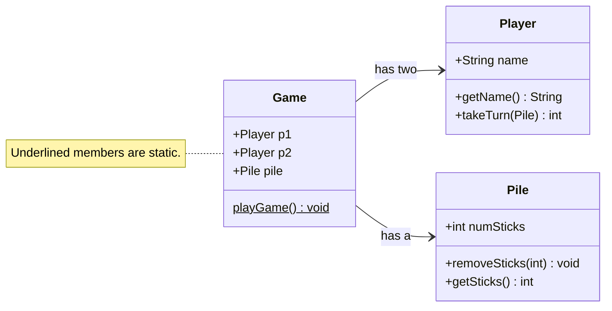
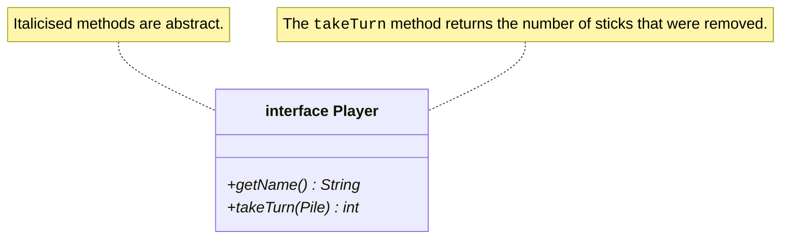
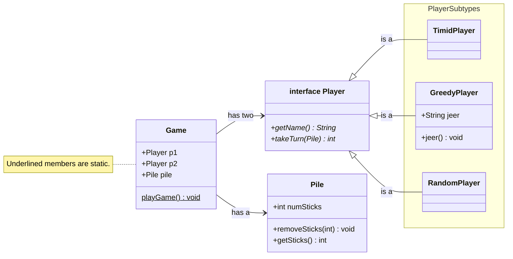

# Interfaces Part 2

> In the previous lesson, we learned about _interfaces_ — both the general concept as well as the program construct in Java.
> In this lesson, we'll walk through an example of creating and using interfaces in a program design process.
> We'll see how interfaces can help reduce coupling and introduce separation of concerns.

## Updating the Nim Game

Will work with the Nim game example that we talked about in the lesson on [a class design process](../06-class-design-process/).
So far, we have a game that only supports human players, i.e., at each turn our `Game` class will pause and wait for a `Player` to manually enter the number of sticks they want to pick up.

In this lesson we'll add support for more kinds of automated players, i.e., bots that the human player can play with.

Please take a minute to go look at the [current implementation of our Nim game](../06-class-design-process/).
We have the following class structure that accomplish the following tasks.
The relationship between the classes here is a _has a_ relationship. I.e., the `Game` class _has two_ `Player`s, and it _has a_ `Pile` as global members (instance variables, or tantamount to instance variables).



We now want to create support for including multiple types of `Player`s — not just "human" `Players` where the game must pause and wait for input from the user.

Ideally, we would like to do this without having to update the `Game` logic too much.

### Our strategy

We can do this by creating a `Player` interface.
The `Game` will still interact with a `Player`, just like it has thus far.

First, we can start by defining a `Player` interface with two abstract methods.



Then, once our `Player` interface is created, we can refactor our `Game` class to _only_ use behaviours that the `Player` interface supports, i.e., to only depend on behaviours that _all_ players can perform, like taking a turn and returning one's name.
As far as the `Game` is aware, both `p1` and `p2` are just `Player`s — but at runtime, they might be any one of the following:

* `GreedyPlayer` — In the `takeTurn` method, the `GreedyPlayer` always takes as many sticks as possible, i.e., 3 if available, or as many sticks as there are left on the pile. Clearly not a winning strategy.
* `TimidPlayer` — This player always the _fewest_ possible number of sticks, i.e., 1.
* `RandomPlayer` — Just for fun, this player picks randomly between 1, 2, and 3 sticks, and takes those many sticks from the pile.
* `HumanPlayer` — This is the player we implemented last week.

## Implementation

### The Player interface

Here is our `Player` interface.

```java
public interface Player {
  String getName();
  int takeTurn(Pile pile);
}
```

> **PONDER**
>
> Notice a change from our previous implementation. Previously, our `Player`'s `takeTurn` method expected as a parameter the number of sticks to remove from the pile. Now, we let each `Player` compute the number of sticks to remove, and we give that information back to the `Game`. **Can you think of why we've made this change?** We will discuss this further below.

### The Timid Player

The `TimidPlayer` always removes one stick from the pile of sticks.

```java
public class TimidPlayer implements Player {
  private String name;

  public TimidPlayer(String name) {
    this.name = name;
  }

  @Override
  public String getName() {
    return name;
  }

  @Override
  public int takeTurn(Pile pile) {
    pile.removeSticks(1);
    return 1;
  }
}
```

### The Greedy Player

Recall that implementing subclasses of the same interface don't *have to* have all the same instance variables.

The interface defines a "lower bound" on what the class must implement. The class _must_ implement the methods declared in the interface, but it _can_ also implement additional behaviours.

Our `GreedyPlayer` has one additional behaviour in addition to what is required by the `Player` interface.
The `GreedyPlayer` is not the sharpest tool in the shed, and in addition to its less-than-optimal game play strategy, it also likes to antagonise its opponent.

So we give the `GreedyPlayer` a `jeer` instance variable.

```java
public class GreedyPlayer implements Player {
  private String name;
  private String jeer; // This player talks smack

  public GreedyPlayer(String name, String jeer) {
    this.name = name;
    this.jeer = jeer;
  }

  public void jeer() {
    System.out.println(this.jeer);
  }

  @Override
  public String getName() {
    return this.name;
  }

  @Override
  public int takeTurn(Pile pile) {
    int toRemove = 0;
    if (pile.getSticks() >= 3) {
      toRemove = 3;
    } else {
      toRemove = pile.getSticks();
    }
    return toRemove;
  }
}
```

### The Random Player

Our `RandomPlayer` uses a [`Random`](https://docs.oracle.com/en/java/javase/21/docs/api/java.base/java/util/Random.html) object to generate a random number of sticks to pick up each time.

```java
import java.util.Random;

public class RandomPlayer implements Player {
  private String name;
  private Random random;

  public RandomPlayer(String name) {
    this.name = name;
    this.random = new Random();
  }

  @Override
  public String getName() {
    return this.name;
  }

  @Override
  public int takeTurn(Pile pile) {
    // If there's more than 3 sticks on the pile, only remove 1--3 sticks.
    // If there's fewer than 3 sticks on the pile, don't try to remove more
    // than the remaining number of sticks.
    int toRemove = this.random.nextInt(1, Math.min(3, pile.getSticks()) + 1);
    pile.removeSticks(toRemove);
    return toRemove;
  }
}
```

### The Game class

With all of that set up, let's think about how the `Game` looks now. (We'll come back to the `HumanPlayer` after this.)

Use the "Walkthrough" button to step through the code below. Take time to read the code and understand what is going on.

The key thing to note here is that the `Game` functions the same way no matter how many different kinds of `Player` subtypes we support.

<!---->
<p>
<div style="width: 100%; margin: auto;">
  <small>
    <a href="Game.html" target="_blank">
      View in new tab
    </a>
    &nbsp;and then click <b>Walkthrough</b>.
  </small>
  <br/>
  <object data="Game.html" width="100%" height="850px"></object>
</div>
</p>


### The Human Player

Finally, let's look at the `HumanPlayer`. We're going to do this bit as an in-class discussion.

In the [previous implementation of the Game](../06-class-design-process#the-game-class), the `Game` was responsible for deciding how many sticks to pick up, and then giving that information to the `Player` object by calling the `takeTurn` method.
However, that meant that the `Game` logic was _coupled with_ the `Player` logic — it knew about the player's strategy for choosing a number of sticks to pick up (i.e., ask the user and wait for input).

In our current implementation, we've introduced a degree of separation between `Game` logic and `Player` logic, setting things up so the `Game` can be totally unaware of how the `Player` takes their turn.
This allowed us to incorporate three different types of `Players`, each with their own turn taking strategies.

> **DISCUSS**
>
> How do we incorporate the `HumanPlayer` into this class structure?

Here are some hints to keep in mind as you think through this (click to expand).

<details>
<summary>Hint 1</summary>

The `Game` has a `Scanner` object that is setup to accept input that the user types in, i.e., `System.in`.

</details>

<details>
<summary>Hint 2</summary>

It is considered good practice to not create multiple `Scanner` objects for the same input stream. So we need to use _this same_ `Scanner` object in the `HumanPlayer` class.

</details>

<details>
<summary>Hint 3</summary>

We need to pass that `Scanner` object to the `HumanPlayer` so that the `HumanPlayer` can use it, while still making it adhere to the `Player` interface.

</details>

## Introducing player-specific functionality

In [Greedy player](#the-greedy-player) implementation above, we included an additional instance variable for the `GreedyPlayer` — the `jeer`.
Suppose we want our `GreedyPlayer`s to "talk smack" every time they play a turn, i.e., we want to them to print their `jeer` each time they take a turn.

I will work through two ways in which to add this behaviour, and we will discuss pros and cons of each strategy.

#### #1 The `instanceof` operator

Strategy 1 is to make the `Game` handle this behaviour.
Whenever a player plays a turn (in the `play` method of the `Game`), we check if the player is an instance of `GreedyPlayer`.
That is, even though the **static type** of `p1` and `p2` is `Player`, we can check at run time if their **dynamic** type is `GreedyPlayer`.

We can do this using the `instanceof` operator.

> The `instanceof` operator works with a variable and a data type, and checks—at run time—if the variable is an _instance of_ that data type.

Below is the `play` method of the `Game` class, reproduced with a few added lines of code.

<!---->
<p>
<div style="width: 100%; margin: auto;">
  <small>
    <a href="play-method.html" target="_blank">
      View in new tab
    </a>
    &nbsp;and then click <b>Walkthrough</b>.
  </small>
  <br/>
  <object data="play-method.html" width="100%" height="500px"></object>
</div>
</p>


#### #2 Make the GreedyPlayer do it

Strategy 2 is to make the `GreedyPlayer` handle this behaviour.

The `GreedyPlayer` already knows what kind of player it is—[dynamic dispatch](../05-method-dispatch/) is already taking care of calling the right `takeTurn` method depending on the player type.
So since we want this behaviour to take place each time the `GreedyPlayer` takes a turn, we could change our `GreedyPlayer`'s `takeTurn` method to the following.

```java
public class GreedyPlayer implements Player {
  // Rest of the class stays the same...
  @Override
  public void takeTurn(Pile pile) {
    int toRemove = 0;
    if (pile.getSticks() >= 3) {
      toRemove = 3;
    } else {
      toRemove = pile.getSticks();
    }

    // ADDED: Talk smack
    System.out.println(this.jeer);

    return toRemove;
  }
}
```

> **DISCUSS**
>
>What are some pros and cons of the two approaches above? Which one do you prefer, and why?

## Summary

By using interfaces, we have introduced a degree of separation of concerns between the `Game` and the `Player`.
The `Game` interacts with two `Player` objects.
Those objects may, at run time, be any one of several possible `Player` subtypes.

_Do you remember what the ability of a variable to be take many possible forms at run time is called?_

The `Game` doesn't know or care about this, since it only knows about the `Player` interface.

The diagram below shows the entire system using a somewhat informal flowchart notation.
Note that the diagram is showing both _has-a_ relationships (wherein one class has instances of another class as instance variables), and _is-a_ relationships (wherein one or more classes are subclasses of another class or interface).


