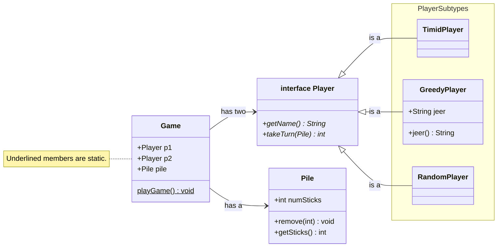
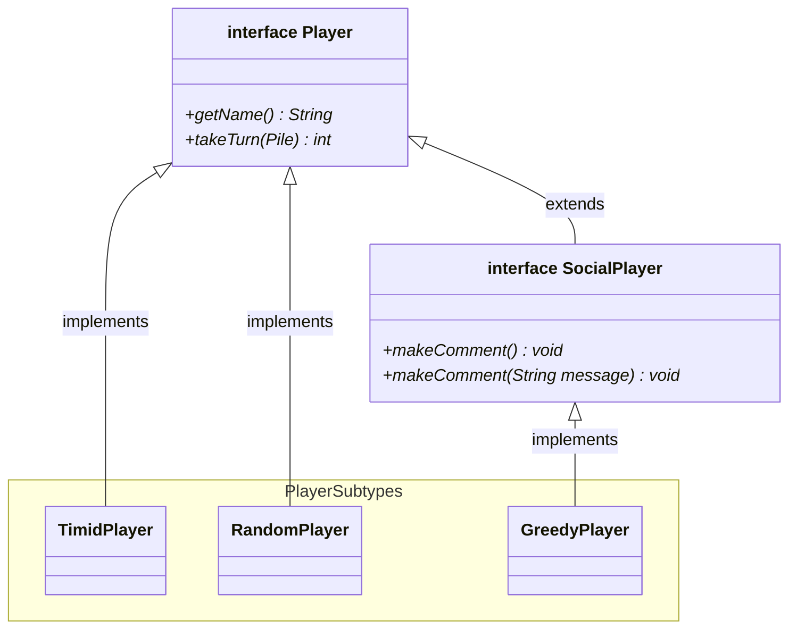
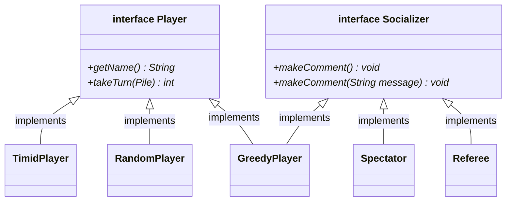
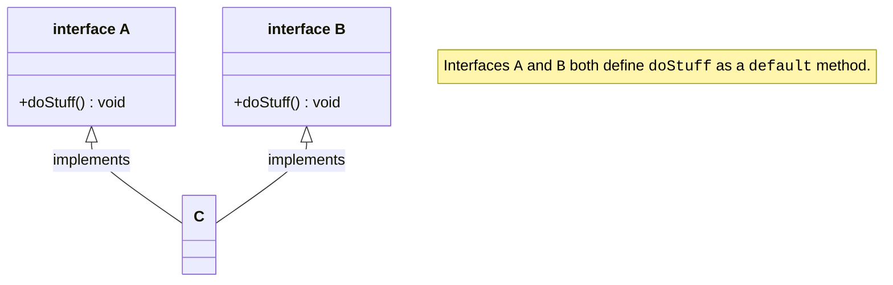

# Interfaces Part 3

## Objectives

> In this lesson you will learn:
>
> * About hierarchical relationships between interfaces, i.e., `public interface > InterfaceA extends InterfaceB`.
> * About how a class can implement multiple interfaces, i.e., `public class MyClass > implements InterfaceA, InterfaceB`.
> * About `default` methods in interfaces.
> * About "the diamond" problem, i.e., what happens when a class inherits two implementations of the same method.

## Recap

* **Interfaces** allow us to define _what_ a type should be able to do, but not _how_ it should do it.
* We do this through the use of **abstract methods** that define a method signature, but no method body.
* Implementing subclasses must including implementations for those methods, and can include additional methods if needed.

In the previous lessons we learned about _interfaces_—both the general idea, as well as the embodiment of that idea in the form of the `interface` construct in the Java language.

Continuing with our running example of the Nim game, we came up with the following class design for the game.

* The `Game` class has two `Player`s and a `Pile` of sticks.
* The `Player` is an interface, which means that at run time the `Player` might be any kind of available `Player` subtype, and the `Game` doesn't know or care which.
* The `Player` interface, in other words, sits between the `Game` and the different player implementations, hiding those implementation details from other parts of the system.



For the rest of this lesson, for the sake brevity, we will only include the `Player` and its subtypes when we consider a diagrammatic view of the class structure.

## Interfaces can extend interfaces

In this lesson, we are going to consider how to incorporate yet more features into our Nim game.

In the design above, we have included support for the `GreedyPlayer` to `jeer` at their opponent each time they take a turn.

Let's suppose want to add support for multiple types of "chatty" players in our system.
That is, we don't want _only_ our `GreedyPlayer` to be able to print a message each time they take a turn—we want to allow _any_ new `Player` type to optionally have this ability.

Let's consider some options to accomplish this.

**Option 1 — Give all players the ability to print a message**

We could give all of our `Player` subtypes a `makeComment()` method that prints the `Player`'s comment to the screen.
We can also give them a `makeComment(String)` overload that prints the specified message to the screen, instead of the `Player`'s pre-defined message.

An advantage of this approach is that it's _simple_.
We can stick a _`makeComment`_ overloaded abstract methods in the `Player` interface, and all implementing subclasses can print their chosen message.

A disadvantage is that this would reduce the _cohesiveness_ of our `Player` type.
For example, the `TimidPlayer` has no intention of presenting a message each time they take a turn — what should the `TimidPlayer`'s `makeComment()` method return? An empty string (`""`)? `null`? Some string that will never be used?

The `Player` interface is now less cohesive because it includes behaviour (`message()`) that is not relevant to _all_ `Player` instances.

**Option 2 — Break out the chatty behaviour into another type**

Option 2 is to separate the behaviour of playing games and "socializing" — they are separate concerns that don't need to be implemented together.

We can do this by creating a separate `interface` for `SocialPlayer`s.
The `SocialPlayer` interface will _extend_ the `Player` interface.

The `SocialPlayer` interface looks like the following:

```java
interface SocialPlayer extends Player {
  void makeComment(); // prints some pre-defined comment
  void makeComment(String message); // prints the specified message
}
```

> In the code above, we use the **`extends`** keyword to declare that the `SocialPlayer` `interface` is a subtype of the `Player` `interface`. That is, all `SocialPlayer`s are `Player`s.

The `SocialPlayer` only declares one (overloaded) behaviour—the `makeComment` methods.
Any class that `implements SocialPlayer` must now include implementations of `Player` methods _and_ implementations of `SocialPlayer` methods.

In our updated Nim game, our `GreedyPlayer` is a `SocialPlayer`, which means it can take turns in the game like all `Player`s, but can also send `message`s.

Here is what the `Player` type hierarchy looks like now. In the diagram below, we use `implements` or `extends` to show the specific keyword used to define the "is a" relationship between a child type and its parent type.



Our `GreedyPlayer` implementation would look the same as before (except instead of `jeer` we now use the more general `makeComment` methods to chat).
But now we can incorporate additional player types that have social behaviours, and treat them all as `SocialPlayer`s in other parts of the system.

```java
public class GreedyPlayer implements SocialPlayer {
  private String name;
  private String jeer; // This player talks smack

  public GreedyPlayer(String name, String jeer) {
    this.name = name;
    this.jeer = jeer;
  }

  @Override
  public void makeComment() {
    System.out.println(this.jeer);
  }

  @Override
  public void makeComment(String message) {
    System.out.println(message);
  }

  @Override
  public String getName() {
    return this.name;
  }

  @Override
  public int takeTurn(Pile pile) {
    int toRemove = 0;
    if (pile.getSticks() >= 3) {
      toRemove = 3;
    } else {
      toRemove = pile.getSticks();
    }
    return toRemove;
  }
}
```

### What's the benefit of doing this?

The `Player` interface introduced a uniform set of behaviours that the `Game` could rely on; i.e., it could expect all `Player` objects to be able to do things like taking a turn, no matter what kind of player subtype they were.

Similarly, the `SocialPlayer` interface introduces a uniform set of _additional_ behaviours that some players can perform—they can make comments.
This opens up an avenue for a version of the `Game` that allows some players (those that support social behaviours) to make comments during game play.

Consider this updated `play` method for the `Game` class.
In the code below, each time a `Player` takes a turn, we give the `opponent` the opportunity to print a message.

We use the `instanceof` operator to check if the `opponent` is an instance of the `SocialPlayer` type, and if so, we print the message.
The `SocialPlayer` interface allows us to change our "view" of the `opponent` object, deciding whether to see it as simply a `Player`, or as a `SocialPlayer`, depending on what set of behaviours we mean to invoke.

```java
public static boolean play(Player p, Pile pile, Player opponent) {
  int sticksTaken = p.takeTurn(pile);
  System.out.println("\n" + p.getName() + " takes " + sticksTaken + " sticks.\n" +
    "There are " + pile.getSticks() + " left in the pile.");

  // Each time a player takes a turn, if the opponent is a social player,
  // print a vaguely threatening message.
  if (opponent instanceof SocialPlayer) {
    ((SocialPlayer) opponent).makeComment("Bad move, " + p.getName() + "!");
  }

  if (pile.getSticks() <= 0) {
      return true;
  }

  return false;
}
```

> **PONDER**
>
> Do you think this is a reasonable use of the `instanceof` operator? Is there any way to print the opponent's message from the `SocialPlayer` implementing subclasses directly?

In the example, we are dealing with both "views" of the `opponent` in the same method.

As a larger example, consider if we wrote a separate, feature-rich "chatroom" module for this Nim game.
We can make that module _only_ view players as `SocialPlayer`s, since it is only interested in the behaviours relevant to social interactions, and not game play.

## Classes can implement multiple interfaces

What if, as part of our expanded Nim application, we wanted to also support general "socializers"? That is, users who are not players in the Nim game, but are still able to make comments that other users can see?

As things currently stand, to create "socializers"—users that can make comments—we would need to implement the `SocialPlayer` interface.
Unfortunately, this brings with it a fair bit of baggage — if you implement the commenting behaviour from the `SocialPlayer`, you need to also implement the game play behaviour from the `Player` interface.
This is due to the hierarchical relationship between `SocialPlayer` and `Player`: all `SocialPlayer`s are `Player`s.

We can decouple the socializing functionality from the gameplay functionality by removing the hierarchical relationship between those interfaces.
That is, instead of wrapping social behaviours into a `SocialPlayer` interface that is a child type of `Player`, we can create two separate, unrelated interfaces:

- The `Player` interface for gameplay behaviours, unchanged from what we have seen so far.
- The `Socializer` interface for social behaviours, like making comments.

> In Java, classes can implement multiple interfaces. These interfaces provide different "views" to the class, or different, well, interfaces through which to interact with the class.

The player subtypes that only support gameplay functionality (like `TimidPlayer` and `RandomPlayer`) will implement only the `Player` interface.
The player subtypes that want to support both gameplay functionality _and_ socializing functionality (like `GreedyPlayer`) will implement _both_ the `Player` and `Socializer` interfaces.
Finally, the users that want to only support socializing functionality (say, `Spectator` or `Referee` objects) will only implement the `Socializer` interfaces.

Here is what our new class structure would look like.
By separating the `Player` and `Socializer` interfaces (instead of having them have a hierarchical relationship), we have allowed classes to more flexibly combine or not combine those behaviours.



To support the structure above, our `GreedyPlayer` only needs to change its signature to implement the two interfaces.
Everything else in the class would remain the same: it still needs to implement all `Player` behaviours, and it still needs to implement all `Socializer` behaviours.

```java
public class GreedyPlayer implements Player, Socializer {
  // Rest of the GreedyPlayer class remains the same
}
```

## `default` methods

The `GreedyPlayer`, `Spectator`, and `Referee` objects all have to include implementations for the two `makeComment` methods from the `Socializer` interface.
The overload that has no parameters, i.e., `makeComment()`, will be different for each implementation.

It makes sense for those three classes to implement their own versions of `makeComment()`.
* The `GreedyPlayer` prints its `jeer`.
* The `Spectator` might print support a message of support for the player that has their allegiance.
* The `Referee` might print a message after conducting some checks concerning game rules.

However, consider that second overload: `makeComment(String)`.
In most cases, the job of that method is to simply print the input it has been given.

**Do we really want to duplicate that code in each of those three classes?**

**Enter `default` methods**. So far, we have only seen _abstract methods_ in interfaces: methods with _declarations_, but no _definitions_. Method _signatures_, but no _bodies_.
These methods must be implemented by a subclass, because otherwise the object cannot actually perform that behaviour.

However, interfaces also allow us to define `default` methods: these are methods in interfaces that _do_ have implementations.
These implementations are inherited by all implementing subclasses, unless the subclass overrides it.[^override]

[^override]: See the lesson on [method dispatch](../05_method_dispatch/) for a review of what is meant by "overriding".

Let us consider the `Socializer` interface as our illustrative example.

```java
public interface Socializer {
  void makeComment();

  default void makeComment(String message) {
    System.out.println(message);
  }
}
```

Each of the implementing subclasses (`GreedyPlayer`, `Spectator`, and `Referee`) will inherit the existing `default` implementation of the second `makeComment` method above.
This means that they only need to implement the first `makeComment()` in order to "fully implement" the `Socializer` interface.
This is great! It saves us from having to duplicate the second `makeComment(String)` method three times.

Of course, they are free to _override_ the `makeComment(String)` method if they want to do something different from inherited `default` method.

For example, suppose the `Referee` wants to print the word `"WHISTLE!"` before each comment they print.

In the code below, the `Referee` class implements one `makeComment()` method because that _has to_ be implemented — it's abstract in the `Socializer` interface.
It also implements the `makeComment(String)` method, this time overriding the default behaviour that was inherited from the `Socializer` interface.

It prints the word `"WHISTLE!"` first.
Then it uses the `super` keyword to invoke the parent implementation of the `makeComment(String)` method.

> The `super` keyword is like the `this` keyword, except the object refers to itself _as its parent type_ instead of its own type.

In the example below, the `super.makeComment(message)` invokes the `makeComment(String)` method from the parent type, i.e., the `Socializer` interface.

```java
public class Referee implements Socializer {
  // Referee's instance variables
  private Game game; // The Game that is currently being refereed

  public Referee(Game game) {
    this.game = game;
  }

  @Override
  public void makeComment() {
    System.out.println(game); // The referee just reports the Game state
  }

  @Override
  public void makeComment(String message) {
    System.out.print("WHISTLE! "); // Referee adds its own behaviour here
    super.makeComment(message); // Referee invokes the Socializer's default behaviour
  }
}
```

> **PONDER**
>
> In the `makeComment(String)` method above, what do you think would happen if we called `this.makeComment(message)` instead of `super.makeComment(message)`?

### The "diamond problem"

So far, we have learned the following facts about interfaces in Java:

* Interfaces can define abstract methods that _must_ be implemented by subclasses.
* Interfaces can also define "concrete" methods using the `default` keyword — these _can_ be overridden by implementing subclasses, or they can be inherited.
* Classes can implement multiple interfaces.

With the facts above in mind, consider the following example.

Class `C` `implements` both interfaces `A` and `B`.
Interfaces `A` and `B` both define the method `doStuff` as a `default` method, but both do different things.



> **PONDER**
>
> Which of the two `doStuff` behaviours should class `C` inherit?

### Java doesn't support multiple inheritance

In a situation like the above, there is simply no way for the compiler to know _which_ `doStuff` method you want to inherit.
So the compiler will show you an error until you give class `C` its own implementation of `doStuff`.
By implementing its version of the method, there is no ambiguity about which one to inherit—`C` inherits neither of the parent interface's `doStuff` implementations.

What if you _wanted_ one of the specific implementations? Do you just duplicate that code? **No.**

In that case, you still need to write your own `doStuff` method, but in the body of the method, you can invoke the specific parent `doStuff` that you want.

So suppose you want the class `C`'s `doStuff` method to do whatever was defined in `interface A`. You do the following:

```java
public class C implements A, B {
  @Override
  public void doStuff() {
    A.super.doStuff(); // Invoke the interface A's version of the method
  }
}
```

## `extends` or `implements`?

So we've seen two ways of creating fairly complex class structures. We can either create a "tree like" structure, where one interface `extends` another interface in order to allow classes to combine those behaviours.
Or we can create a "flatter" structure by creating multiple interfaces; classes that want to combine those behaviours simply need to implement both interfaces.
And `default` methods allow us to also introduce some code reuse into this picture.

**Interfaces let you create non-hierarchical type frameworks.** Not all class organisations lend themselves to tree structures. That is, you may want different combinations of types "mixed together" for specific subclasses. To achieve this flexibly with `extends` relationships, you would end up with many more "intermediate" layers in your type hierarchy, creating a separate type for each combination of functionality you want to support. With interfaces you have infinite flexibility to enhance class behaviours as needed.

However, it is often easier to reason about tree-like structures, because there is less ambiguity about what classes can perform what behaviours.
This "straightline" flow of inherited behaviours can often be a blessing in a large, complex class structure.
If you know you're not likely to add new classes that support some behaviours but not others, it may be worthwhile to commit to a tree-like structure using `extends` for the time being.

## Summary

To sum up, here are some facts about interfaces:

- Interfaces can have abstract methods. These only have method signatures, but not method bodies. There is no special keyword for abstract methods in interfaces.
- A class that `implements` an interface _must_ include implementations for all abstract methods in a parent interface.
- Interfaces can also have methods that _do_ have implementations. These are created using the `default` keyword.
- Implementing subclasses _can_ include implementations for the `default` methods from the parent interface; this will override the interface's `default` behaviour for that method.
- Interfaces can have `static` variables and `static` methods.
- Interfaces **cannot** have instance variables.
- Interfaces can extend other interfaces using the `extends` keyword. If a class declares that it `implements` an interface, and that interface has "parent" interfaces, the class must implement all abstract methods from the immediate parent as well as all the "grand parent" interfaces.
- Classes can implement more than one interface.
