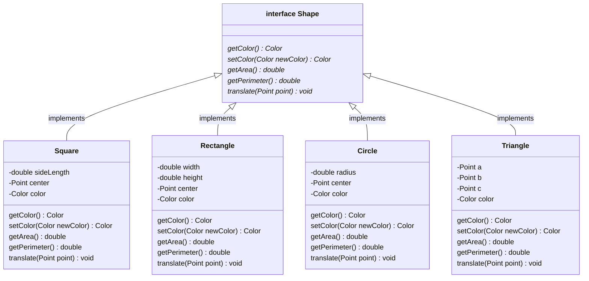
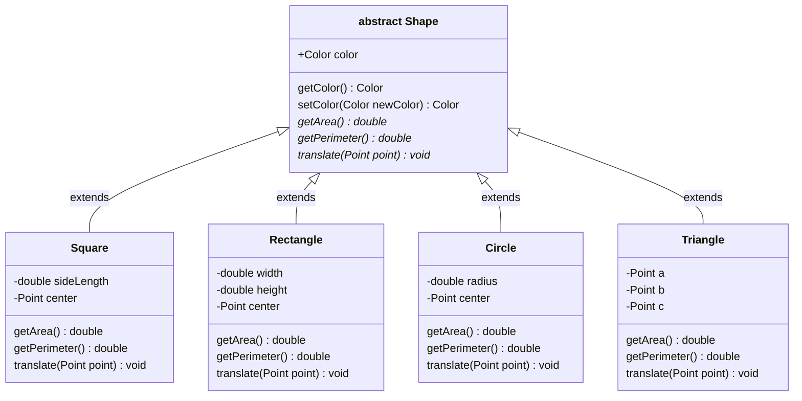

# Abstract classes

We learned about interfaces in Java in the previous lessons.
For a recap, please take a look at the [Summary](../09-interfaces-part-3#summary) from the previous lesson.

Interfaces come with numerous benefits:

1. They let us introduce a degree of separation between implementation details of different classes in a larger Object-oriented system.
2. `default` methods in interfaces let us "pull up" common method implementations into the interface, allowing implementing subclasses to inherit those methods. This saves us from having to duplicate code.

However, interfaces are just one way to achieve _polymorphism_ in Java.

> In this lesson, we will learn about a related Java construct called _abstract classes_.
Abstract classes are just like regular classes in Java, except they can have *abstract methods.* There are a few similarities and differences between abstract classes and interfaces in Java.

**Differences between interfaces and abstract classes**

- Abstract methods in abstract classes must be marked using the `abstract` keyword. (In interfaces, there is no keyword used for abstract methods.)
- Abstract classes _can_ have instance variables, while interfaces cannot.
- A class `extends` an abstract class, while it `implements` an interface.
- Classes can extend _at most one_ abstract class, but it can implement more than one interface.

**Similarities between interfaces and abstract classes**

- Both abstract classes and interfaces are forms of polymorphism in Java.
- Like an interface, an abstract class can have both abstract and concrete methods.
- Concrete methods in interfaces must be marked using the `default` keyword. (In abstract classes, there is no keyword used for concrete methods.)
- Just like an interface, you _cannot_ use an abstract class to initialise an object. The abstract class might have abstract methods, so this makes sense. (We don't want to create objects with "gaps" in their functionality.)

We'll motivate the use of abstract classes by first looking at a disadvantage of using interfaces.

## A disadvantage of using interfaces

Consider the following interface-based type hierarchy.

In the `Shape` interface below, we have five abstract methods, each of which needs to be implemented by the four subtypes.



Implementations for `getArea`, `getPerimeter`, and `translate` would likely be different for each subclass, and need to implemented on a per-class basis.
For example, calculating the area for a square is different from that of a circle, which is different from that of a triangle, etc.

However, implementations for `getColor` and `setColor` are likely be _identical_ for all the subclasses—chances are they have a `private Color color` instance variable, and they are pretty standard getters and setters.

> Because interfaces cannot have instance variables, any code that directly touches those instance variables _must_ be written in the implementing subclasses, even if is the same for all subclasses.

## Abstract classes

Abstract classes can help us in these types of situations.
Specifically, they are useful when:

- We want a set of classes to adhere to a common public interface.
- The implementing classes share both data and behaviour. That is, they have shared methods and instance variables.

Right now, the `color` instance variable and its getter and setter methods are all being duplicated in the four child classes.
If we instead write `Shape` as an abstract class, we can "pull up" that data and behaviour into a common parent, thereby allowing all the subclasses to re-use that code.

In the new hierarchy below, which uses an abstract class, we can see that the subclasses have reduced in size because they now do not duplicate the shared behaviour.


> **DISCUSS**
>
> Do you see further opportunities for improvement to the structure above? Is there any other duplicated data that can be "moved upward" to reduce code duplication?

### Code for the example above

#### The Shape abstract class

See the `Shape` abstract class below. Please use the "Walkthrough" button to see notes about important parts of the code below.
In particular, there are two new keywords introduced in the code below: `abstract` and `protected`.

<!---->
<p>
<div style="width: 100%; margin: auto;">
  <small>
    <a href="Shape.html" target="_blank">
      View in new tab
    </a>
    &nbsp;and then click <b>Walkthrough</b>.
  </small>
  <br/>
  <object data="Shape.html" width="100%" height="800px"></object>
</div>
</p>


Since the `Shape` is abstract, you can't do this:

```java
// This code won't compile
Shape myShape = new Shape(new Color(255, 0, 0)); // A red....shape?
```

Just like an interface, an abstract class is a skeleton for its subclasses — it can't be used to create objects. It's a convenient construct for placing common code in one place so that subclasses don't have to duplicate it.

#### The Triangle class

Code for the `Triangle` class is below. Please use the "Walkthrough" button to step through the accompanying notes. Here are some key features to note:

* **`extends`**: We use the `extends` keyword to extend an abstract class. A class can extend _at most one_ abstract class. But it can implement as many interfaces as needed.
* **`super`**: In the `Triangle` constructor, we use the `super` keyword to invoke the "super constructor". This is used to initialise the parent class's instance variables. In this case, when the `Triangle` is created using the `Triangle` constructor, it needs to tell the parent class (`Shape`) to also initialise _its_ instance variables.

<!---->
<p>
<div style="width: 100%; margin: auto;">
  <small>
    <a href="Triangle.html" target="_blank">
      View in new tab
    </a>
    &nbsp;and then click <b>Walkthrough</b>.
  </small>
  <br/>
  <object data="Triangle.html" width="100%" height="1500px"></object>
</div>
</p>


## Interfaces or abstract classes?

The key consideration is that a class can implement _at most one_ abstract class.

If your class hierarchy is designed using only abstract classes, you are necessarily going to end up with a tree-like structure, where very child type has exactly one parent type.
Sometimes this simplicity is desirable, and sometimes it is too restrictive.

On the other hand, if you create a class hierarchy only interfaces, you end up with a "flatter" hierarchy that is much more flexible, since classes and implement multiple interfaces.
This allows you to "mix in" different parent types for individual subclasses, as needed.
This flexibility can be a blessing, but can also become difficult to reason about as your project grows.

Or, more likely, you will use some combination of abstract classes and interfaces.

Suppose you have a bunch of interfaces `A`, `B`, `C`, and `D`.
You have created a number of subclasses that implement various combinations of these interfaces, but you find yourself creating some combinations more often than others.
For example, you find yourself creating many classes that implement both `B` and `C`, and end up duplicating instance variables and methods in those classes.
In this case, it may make sense to create an abstract class that `implements B, C`, and root all of that common data and behaviour in the abstract class.

Yet another possibility is to use _neither_, at least when you're working on a smaller system.
Sometimes too much polymorphism can be a bad thing.
If it's a simple function and you only do it once, perhaps you don't need to create a whole type hierarchy to do what you could have done with a "type" variable and an `if` condition. If you find yourself frequently checking this "type" variable before performing tasks, _that's_ when you could consider using polymorphism.

Like many problems in software design, there is no "silver bullet" that solves all your problems.
You will face tradeoffs and make choices about how to design your systems.
