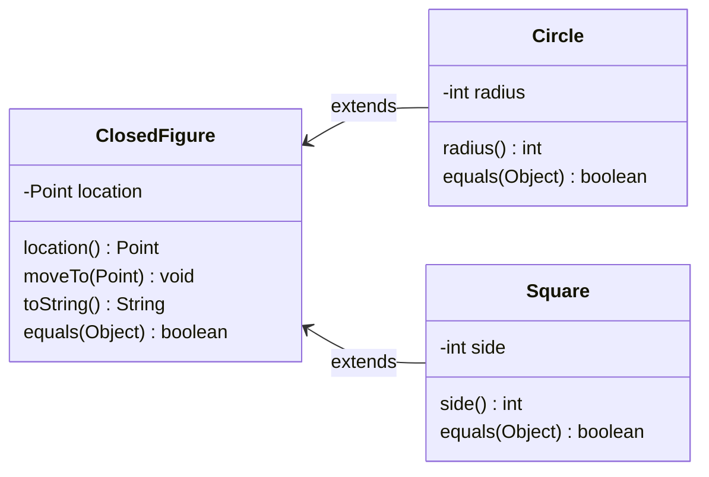

# Inheritance and equality

## Plain old inheritance

So far, we have seen two ways of using polymorphism in Java: interfaces and abstract classes.
In this lesson we will (briefly) talk about "plain old inheritance".

In short: it is possible for "regular old classes" to be `extend`ed by other classes.
For example, we could have...

```java
public class A extends B {
  private int var1;

  public A(int var1, int var2) {
    super(var2); // Just like abstract classes, we need to invoke the super constructor
    this.var1 = var1;
  }
}
```

...but unlike the examples about abstract classes, `class B` is a class _in its own right_.
It represents an abstraction that can also be used to create objects.

On the other hand, abstract classes help us to avoid code duplication and help us root shared behaviours in a common type, but we cannot create objects from abstract classes.

A common example of this type of inheritance is GUI component libraries.
For example, the Android development framework provides a bunch of classes that can be used for various frontend components, like `Button`, `TextArea`, or `ListView`.

All of these classes are usable components in their own right, and can be used to create objects.
However, it's likely that an Android app developer would want to create their own specialised versions of these components.
For example, they may want to create a `TextArea` that has line numbers.
To do that, they might create a class like:

```java
public class LineNumberTextArea extends TextArea {
  ...
}
```

**You've already seen plain old inheritance through the `Object` class.**

In the lesson on [method dispatch](../05-method-dispatch/), we saw the following line of code.

```java
Object obj = new Object();
```

The fact that we were able to initialise the `obj` variable using the `Object` constructor should tell you that `Object` is _not_ an abstract class.
And, as we know, all reference types `extend` the `Object` class, and can inherit or override `Object`'s behaviours.

Below are two methods defined in the `Object` class that are commonly overridden in subclasses. (There are more, but these two are relevant for this discussion.)

- `public String toString()`: Computes and returns a `String` representation of the object. For the `Object` class, this simply returns the object's hash code (an unique-as-far-as-possible integer representing the object). This (not super useful) behaviour will be inherited by a subclass unless the subclass overrides it by writing its own `toString` method.
- `public boolean equals(Object other)`: Checks if this `Object` (the calling object) is logically equal to the `other` object. For the `Object` class, this method checks if they are the same object (i.e., it is the same as using the `==` operator). If a subclass wants to define a more useful `equals` method, it must override it.

## `toString`

The `Object` class defines a `toString` method whose job it is to return a short, human friendly string representation of the object.
For a plain old `Object` which is almost never used directly by developers, this `toString` method simply returns the object's hash code, which itself is simply an integer representation of the object's memory address, unless you override it yourself, [which you should](../12-hashcode/).
The `Object` has no other distinguishing features, so there's not much more to say about it.

**You should always override `toString` when you write your own classes.** It's often useful to have a `toString` method for your own classes.
It brings a number of conveniences.

1. You can simply "print" an object's info by giving the object as an argument to `System.out.print`. The `print` method will automatically call `toString` on whatever its argument is, if its argument is not a `String`. If you don't write a `toString` method, the runtime will simply move up the type hierarchy until it finds a `toString` method, and call that instead.[^polymorphism]
2. When you give your object a `toString` method, you "buy into" a larger ecosystem of libraries.

For example, suppose you've created your own custom linked list class, called `MyLinkedList`.
For simplicity, let's say the list contains integers, and you are performing some complex operations on this linked list.

You will hopefully be writing tests to check that your list functions are behaving as expected. E.g., you might write something like this:

```java
// Expected value is a list like 1 --> 2 --> 3
MyLinkedList expected = new MyLinkedList(new Node(1, new Node(2, new Node(3, null)));
MyLinkedList actual = .... // Assume you have called some complex function here that returns a list
assertEquals(expected, actual);
```

If your test passes, all well and good.
However, if your test fails, you're going to see an error message like this:

```txt
Expected: MyLinkedList@eb2184
Actual: MyLinkedList@ai02481
```

The JUnit failure message for `assertEquals` automatically uses the object's `toString` method to communicate the expected value and actual values to the user.
If you do not write a `toString` method, you're going to get the gibberish above.

If you *do* write a `toString` method, you will get much nicer error messages in JUnit.
For example, assuming you wrote a `toString` method that prints out each node's value with an arrow between them, you would see the following:

```txt
Expected: 1 --> 2 --> 3
Actual: 3 --> 2 --> 1
```

Much easier to interpret!

**In general, IDEs and libraries will use the `toString` method whenever they need to refer to an object in text output for a human to read.**

Another really important example is the [debugger in IntelliJ IDEA](https://www.jetbrains.com/help/idea/debugging-code.html) and most other Java IDEs. When you inspect a variable's value while debugging, the debugger by default displays the result of calling `toString` on that variable.
Without a `toString` method for custom classes, you are just going to be given the Object's default `toString` which as we've seen above is not very useful.

For example, consider the image below, reproduced from [IntelliJ's help docs](https://www.jetbrains.com/help/idea/debug-tool-window.html#sessions). In the screenshot, the user is inspecting the `this` object, which appears to be a `Whale` object.
Unfortunately, the `Whale` in this example does *not* have a `toString` method, so the user has to expand the `this` object to inspect its data.
If the `Whale` *did* have a `toString`, that value would be printed instead of `{Whale@784}` (the object's hash code).


A well-written `toString` can make this type of debugging go much faster.

### `toString` should not have any side-effects!

This is a **REALLY IMPORTANT** requirement of `toString` methods. A `toString` method must **not**, under any circumstances, make changes to an object, or generally have any other effects other than computing and returning a `String`.

Because the `toString` method is implicitly used by so many libraries, it can lead to really subtle and hard-to-track-down bugs if the `toString` method also causes other effects like mutations, or writing to a file.

A real example: In Spring 2023, in a java programming assignment, a student was reading data from a file in their `toString` method.
Each file read was triggering a "cache miss counter" which counted how many times the file was read.
This counter was supposed to end up with values within an expected range.
Imagine their surprise when the program worked differently when it was run in debug mode vs. regular mode vs. test mode!
Each use of `toString` (whether the student called it themselves or not) caused the counter to trigger — this means that, in addition to normal circumstances, the counter got triggered when a JUnit test case tried to display results, and when the student tried debug their program using the debugger.

The act of using the debugger was itself manifesting the bug the student was trying to track down. What a nightmare!

## `equals`

Next up, we will talk about the `equals` method in Java.
All the way in the [first lesson](../01-intro-java/), we talked about how reference types (i.e., objects) must *not* be checked for equality using the `==` operator.
We must instead use the `.equals` method.

The `Object` class provides an `equals` method that all classes inherit, unless they write their own `equals` method.
This "fallback" `equals` method does the same check as `==` — it checks if two variables' memory addresses are the same.
That is, it checks if they both point to the same object.

Like we've seen, this is not super useful. We can write our own `equals` method.

The `equals` method in the `Object` class has the signature: `public boolean equals(Object other)`. Notice that it takes an _`Object`_ as a parameter—it has to, because as far as `Object` is concerned, no other classes exist.

This means that when we override `equals` in a subclass, even the subclass's `equals` method needs to take an `Object` as a parameter.

Every `equals` method must do the following checks.

1. Check if the incoming object is `null`. If it is `null`, then we cannot be equal to it, so return `false` and quit.
   - This step is necessary because we need the object to actually exist in order to check its type.
2. Check if the incoming object has the same type as our `this` object. If it does not, then we cannot be equal to it, so return `false` and quit.
   - This step is necessary because we need the types to match to be able to cast the incoming object to the `this` object's type. Because the parameter type is declared to be `Object`, you can call any `equals` with pretty much _any_ parameter. We don't want nasty runtime errors because of that.
3. If the types match, cast the incoming object to our type, so that we can access its data.
   - This step is needed because we can't access the data we're interested in from the incoming object while its static type is still `Object`.
4. Compare the fields you need to compare to determine equality.
   - This step is necessary for, well, checking equality.

The `equals` method is a regrettably clunky bit of tedium baked into the Java language.
Arguably, only step 4 above is germane to the task of deciding whether two objects are equal — all the other steps are just us fighting with the type and inheritance systems to be able to actually compare the data we want to compare.
Unfortunately, as described above, all the steps are necessary or we risk runtime exceptions.
So it goes.

Luckily, most IDEs can generate an equals method for you if you have a class that contains instance variables.

See the `Person` class below for an example.
It contains two instance variables: `name` and `age`, and an `equals` method that considers two `Person` objects "equal" if they have equal names and equal ages.

Use the "Walkthrough" button to see how each check that was described above is carried out.

<!---->
<p>
<div style="width: 100%; margin: auto;">
  <small>
    <a href="Person.html" target="_blank">
      View in new tab
    </a>
    &nbsp;and then click <b>Walkthrough</b>.
  </small>
  <br/>
  <object data="Person.html" width="100%" height="700px"></object>
</div>
</p>


**You should always write an `equals` method for any class that you create.**
Like the `toString` method, this buys you into a larger set of libraries.
For example:

- The JUnit `assertEquals` method uses the `equals` method to check if its two arguments are equal.

```java
Point a = new Point(2, 3);
Point b = new Point(2, 3);

assertEquals(a, b);
```

The `assertEquals` above is equivalent to doing `assertTrue(a.equals(b))`.
That is, `assertEquals` calls the `equals` method of the first argument, using the second argument as the input.
If you do _not_ write an `equals` method, the test above will fail, because it will be checking _sameness_, not equality.

- Java collections use the `equals` method for things like checking if a list contains an object, etc.

Suppose you had the following `List<Person>`, and it contained some `Person` objects.

```java
List<Person> people = List.of(
   new Person("Joe Bro", 29),
   new Person("Pooja Ahuja", 31)
);
```

Then, suppose in another function, you need to check if `"Pooja Ahuja"` exists in this list.
You would use the list's `contains` function to do this check.

```java
Person pa = new Person("Pooja Ahuja", 31);
assertTrue(people.list(contains(pa))); // Will this test pass or fail?
```

The `contains` method loops over the items in the `people` list, and checks if each one `equals` the `pa` object.
If you do _not_ give `Person` an `equals` method, it will default to inherited `equals` behaviour, i.e., it will check whether any item in the list is the _same_ object as the one that `pa` points to.
This means the test above will fail.

If you _do_ write an `equals` method for `Person`, the `contains` method does a much more logical check for equality—it checks each person in the `people` list and returns `true` if it finds a `Person` with the same name and age as `pa`.

## Inheritance and equality

...or, why we don't use `instanceof` in the type check of an `equals` method.

Notice that in the `equals` method above, we are doing the type check using `this.getClass().equals(other.getClass())` and not `other instanceof Person`.
The `getClass` method is inherited from `Object`, and returns the dynamic type of the calling object.

> Comparing the _class_ of two objects lets you do an _exact match_ comparison.
So if `this` is a `Person` object, the boolean expression `this.getClass().equals(other.getClass())` will be `true` if and only if `other` is also a `Person` object.
> On the other hand, the boolean expression `other instanceof Person` will be `true` if `other` is a `Person` object or if it is some subtype of `Person`.

Let's see an example of how this can go wrong.

Consider the following type hierarchy.

- We have a `ClosedFigure` that has a `location`, a getter and setter method for it, and an `equals` method (two `ClosedFigure`s are considered equal if they have equal locations).
- We have a `Circle` that extends `ClosedFigure` and additionally has a `radius`. Two `Circle`s are considered equal if they have equal radii *and* locations.
- We have a `Square` that extends `ClosedFigure` and additionally has a `side` length. Two `Square`s are considered equal if they have equal side lengths *and* locations.

`Circle` and `Square` each have their own override of `ClosedFigure`'s `equals` method.
None of these classes are abstract.



Let's take a look at the `equals` methods for these three classes.

### `ClosedFigure` `equals`

The code below shows an `equals` method for the `ClosedFigure` class.
Two `ClosedFigure`s are considered equal if they have the same location.

This is pretty standard, just like we saw for the `Person` example above.

```java
@Override
public boolean equals(Object other) {
   if (other == null) {
      return false;
   }

   if (getClass().equals(other.getClass())) {
      return false;
   }

   return this.location.equals(((ClosedFigure) other).location);
}
```

### `Circle` `equals`

Two `Circle`s are considered equal if they have the same radii _and_ they have the same location.
Now, we could easily copy the `equals` method from above and just add an `&&` to that last return statement to also check the radii of the circles.
But that would be code duplication, and we don't want that.

Instead, since `Circle extends ClosedFigure`, we can use that inheritance relationship so re-use `ClosedFigure`'s equals method for the location check (and really, all the other checks except the radius check).

In the code below, there is no null check or type check—those checks are already being taken care of by the `ClosedFigure` class.

```java
@Override
public boolean equals(Object other){
   return super.equals(other) && this.radius == ((Circle) other).radius;
}
```

The compound boolean expression in the return statement above will "short circuit" if the first condition is `false`.
That is, if `super.equals(other)` is `false`, the rest of the condition doesn't matter, so it just won't be checked.

### `Square` `equals`

Similarly, the `Square`'s equals method can be simplified by re-using the `equals` method from the parent class.

```java
@Override
public boolean equals(Object other){
   return super.equals(other) && this.side == ((Square) other).side;
}
```

## Some examples

Because the `ClosedFigure` equals method uses `getClass` for the type check, [dynamic dispatch](../05-method-dispatch/) takes care of getting the right class name at run time.

So even if you created an object like so:

```java
// Create a circle with location and radius
ClosedFigure fig = new Circle(new Point(2, 2), 10);
```

If you called `fig.getClass()`, you would `Circle` in return, not `ClosedFigure`.

### Example 1

```java
ClosedFigure fig = new Circle(new Point(2, 2), 10);
Circle fig2 = new Circle(new Point(2, 2), 10);
```

> **PONDER**
>
> What would `fig.equals(fig2)` return in the code above?

Here is what happens:

1. In the code above, dynamic dispatch would call `Circle'`s equals method, with `fig` as the calling object (i.e., `this`).
2. `Circle`'s equals method will in turn call `ClosedFigure`'s equals method.
3. In `ClosedFigure`'s equals method, we move past the `null` check, since `fig2` is not null.
4. We also move past the type check, because `this.getClass()` returns `Circle`, and `other.getClass()` also returns `Circle`, because of dynamic dispatch. Even though we are tracing code in the `ClosedFigure` class, the _calling object_ is a `Circle` at run time.
5. Since the type check passed, we cast `other` to a `ClosedFigure` and check its location. That check will pass, since both locations are `(2, 2)`.
6. Finally, we come back to the `Circle` class, cast `other` to a `Circle` and compare radii.

### Example 2

Suppose in our `ClosedFigure` class, we had used `instanceof` instead of `getClass`. That is, the type check was carried out using `other instanceof ClosedFigure`.

> **PONDER**
>
> Looking at the same example as above, what would the outcome of `fig.equals(fig2)` be?

**There would be no change**. At the moment of the type check, we would check if `other instanceof ClosedFigure`. `other` is a `Circle`, which _is a_ `ClosedFigure`. So everything is okay, and our type casts go through without a problem.

### Example 3

Finally, think about the following example:

```java
Circle circle = new Circle(new Point(2, 2), 10);
Square square = new Square(new Point(2, 2), 23);

assertTrue(circle.equals(square));
```

> **PONDER**
>
> What would outcome of `fig.equals(fig2)` be? Would it be different using `getClass` vs. `instanceof` in the `ClosedFigure` type check?

Let's trace the call `circle.equals(square)`.

1. First, we call the `Circle` `equals` method. That immediately calls the superclass's `equals` method.
2. In the superclass equals method (`ClosedFigure::equals`), we first check if the argument is `null`. It is not (`square` was initialised in this example), so we move on.
3. Next, we check the type. Let's think about what happens if we use `instanceof` here vs. `getClass`. If the check was `other instanceof ClosedFigure`: yes, `square` is an instance of `ClosedFigure`, because of the inheritance relationship between `Square` and `ClosedFigure`. So move past this check.
4. Because the type check was good, we do the type-cast. This is also fine.
5. The `location` check also passes, because `circle` and `square` are both at the location `(2, 2)` in this example.
6. The `ClosedFigure` `equals` method returns `true`, because all the `ClosedFigure` stuff was equal! We bounce back to the rest of the `Circle` `equals` method.
7. Because the `super.equals(other)` part passed, we check the right-hand-side of the compound `&&` expression.
8. **At this point, our code will crash**. We attempt to cast `other` to a `Circle`, but `other` is a `Square`!

This mismatch only occurs if in the `ClosedFigure` equals method, we use `instanceof` to check the type. The `Square` _is_ an instance of `ClosedFigure`, so even though the two objects are of different types, our equality check doesn't quit at that line.
This is why we use `getClass` to perform the type check in an `equals` method.

## Summary

In 99% of cases, you should use `instanceof` for type-checking in Java (though if you are doing a lot of type-checking yourself, you should step back and consider your object-oriented design). In `equals` methods, where we need an _exact accounting_ of the differences between two objects, we need to use `getClass` if we want two objects with the same parent equals method to be treated differently.

Of course, our other option is to perform the type checks in each subclass in addition to the superclass — if you do that, you can use `instanceof` as usual, because the equals method will appropriately fail at the subclass's type check.

You might say that this code duplication is tiresome, but...so is the `equals` method.

[^polymorphism]: This is a good example of polymorphism. The `System.out.print` method asks for an `Object` as a parameter. The actual argument its given might be _any type_, as long as it's a subtype of `Object`. All the `print` method cares about is that its input can produce a string representation of itself, i.e., it can call `toString`.
