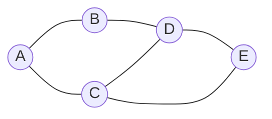
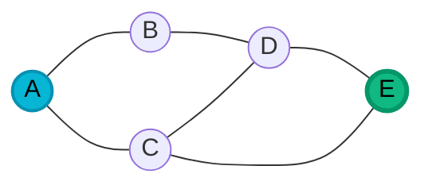
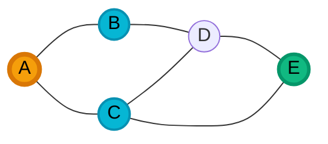
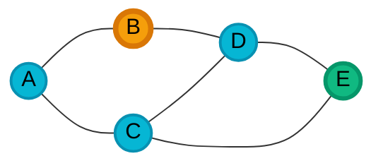
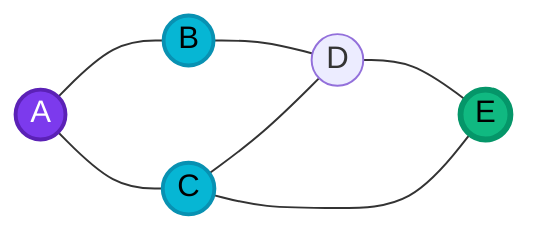
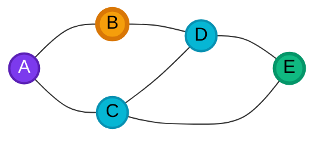
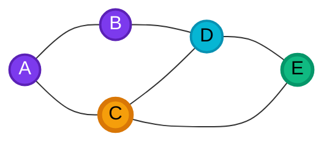
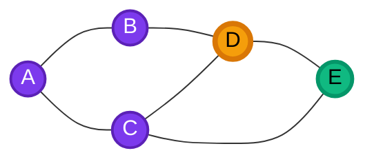
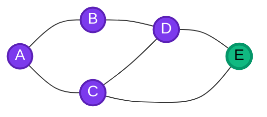

# Search algorithms 

> In this lesson, we'll do a brief recap about search algorithms with which we're already familiar (depth-first search and breadth-first search), and use those as a launchpoint to talk about a "smarter" search algorithm called A* search (pronounced "A-star").
>
> This lesson is not quite an _object-oriented programming_ lesson per se. It's definitely very specifically tied to one of the programming projects.

In your previous class (for many of you, CSC 202 _Data Structures_), you learned about [_binary trees_](https://en.wikipedia.org/wiki/Binary_tree).
A binary tree is a recursive data structure.
A binary tree is either empty, or it consists of a _node_ that has at most two children, each of which is itself a binary tree.

You can also have general _trees_, which are similar to binary trees, except that each node can have any number of children (not just two).

One of the many operations you can perform in trees is to _search_ for a particular value, using some _search algorithm_.

## The anatomy of a search

In general, most search algorithms have the following general structure:

* First, know your `startNode` and your `targetNode`.
* Initialize your "to-do" list of nodes that need to be explored during the search.
* Add your `startNode` to the "to-do" list.
* While your to-do list is not empty:
  * Remove the next node from the to-do list.
  * Is it the `targetNode`? If so, you're done!
  * If it's not the `targetNode`, add its children to the to-do list.
  * Run this loop again.
* If you end the loop without having found `targetNode`, then it must not be reachable from `startNode`.

This general structure can describe numerous search algorithms.
Two examples come to mind:

A **depth-first search** searches by searching the root node first, then recursively searching each subtree.
The following animation from Wikipedia illustrates it well:

<figure>

<figcaption>Depth-First Search example on a tree structure. First the root is explored, then each subtree is explored recursively. 
By <a href="//commons.wikimedia.org/w/index.php?title=User:Mre&amp;action=edit&amp;redlink=1" class="new" title="User:Mre (page does not exist)">Mre</a> - Own work, <a href="https://creativecommons.org/licenses/by-sa/3.0" title="Creative Commons Attribution-Share Alike 3.0">CC BY-SA 3.0</a>, <a href="https://commons.wikimedia.org/w/index.php?curid=6342841">Link</a>
</figcaption>
</figure>

In contrast, a **breadth-first search** searches by searching all nodes at the present depth prior to moving on to the nodes at the next depth level.

<figure>

<figcaption>Breadth-first search on a tree structure. First the root is explored, then each node at the next level, then the next level, and so on. Also sometimes known as a "level-order" search. 
<a href="https://commons.wikimedia.org/w/index.php?curid=1864649">By Blake Matheny, CC BY-SA 3.0</a>
</figcaption>
</figure>

The _only_ difference between DFS and BFS is the order in which nodes are removed from the to-do list.

> That is, **the choice of data structure used for the to-do list determines whether the search will be depth-first or breadth-first**.
A DFS uses a _stack_ (last-in, first-out), while a BFS uses a _queue_ (first-in, first-out).

## Search in a graph

> Searches in graphs require a small but crucial modification to the general search algorithm above.

The steps above are sufficient for searches in _tree_ data structures.
However, in this lesson, we will be focusing on searches in _graph_ data structures.

A **graph** is a set of nodes (also called _vertices_) connected by edges.
Some key differences between graphs and trees are:

- In graphs, there's no fixed "root" node. Typically, a "search" in a graph starts from some arbitrarily chosen `startNode`.
- In graphs, nodes can be connected in arbitrary ways, as opposed to the hierarchical parent-child relationship seen in trees.

For example, this is a graph, but not a tree:

Crucially, in graphs, there may be _cycles_.
**Cycles** occur when a node is reachable from itself by following a sequence of edges.
In the example above, we can start at `A`, and take a series of edges to get back to `A` again: `A -> B -> D -> C -> A`.

> **PONDER**
>
> Run through our general search algorithm above in your head, using the graph above, starting from node `A` and searching for node `E`. What problem do you run into?

Let's do the above search using BFS.

We'll by marking `E` as our target, and adding `A` to our to-do list, which is a queue (because BFS).

- target
- current node
- to-do list 
<!--- The purple nodes have already been visited.-->

Our next step is to dequeue `A` from the to-do list, and explore it. Here "exploring" it means checking if it's our target. It's not, so we enqueue its neighbours, `B` and `C`.

- target
- current node
- to-do list 
<!--- The purple nodes have already been visited.-->

Now, we'll dequeue `B` from the to-do list, because it was "first in", and explore it.
Again, exploring it means _adding its neighbours to the to-do list_.

**At this point, we have a problem**.
When we explore `B`, and try to add its neighbours to our to-do list, we would correctly enqueue `D`. But because `A` is also a neighbour of `B`, we'd end up re-adding `A` to the list!

- target
- current node
- to-do list 
<!--- The purple nodes have already been visited.-->

Because of this, our search would just ping-pong between `A` and `B` forever, never reaching our target `E`. That is, we'd go into an infinite loop.

**How can we avoid this?** We need to also keep track of which nodes we've already _visited_. Let's revisit our "anatomy of a search", with **the bolded addition**:

* First, know your `startNode` and your `targetNode`.
* Initialize your "to-do" list of nodes that need to be explored during the search.
* Initialize your "visited" set of nodes that have already been explored.
* Add your `startNode` to the "to-do" list.
* While your to-do list is not empty:
  * Remove the next node from the to-do list.
  * Is it the `targetNode`? If so, you're done!
  * **Mark the current node as visited.**
  * If it's not the `targetNode`, add _only its unvisited neighbours_ to the to-do list.
  * Run this loop again.
* If you end the loop without having found `targetNode`, then it must not be reachable

### Searching while keeping track of visited nodes

Now, our search can proceed as follows. Once again, starting by enqueuing `A`.

- target
- current node
- to-do list 
<!--- The purple nodes have already been visited.-->

Next, we make `A` our current node by dequeing it and adding its neighbours:

- target
- current node
- to-do list 
<!--- The purple nodes have already been visited.-->

**The big addition here is that we now mark `A` as visited before picking up one of its neighbours to search next**.

- target
- current node
- to-do list 
- visited

We can now proceed to dequeue `B`, explore it, and add its unvisited neighbour `D` to the to-do list (but not `A`, since it's already been visited):

- target
- current node
- to-do list 
- visited

The search can now make forward progress, instead of going in circles. We now mark `B` as visited, and pick up `C`, since that's first in our queue.

`C` has three neighbours: `A` (already visited), `D` (in the to-do list already), and `E` (our target!).
We will add only `E` to the to-do list (but we won't change its colour in the graph below—don't want you forgetting that its our target!).

- target
- current node
- to-do list 
- visited

Next, we'll mark `C` as visited, and dequeue `D` from the to-do list.

- target
- current node
- to-do list 
- visited

`D` has no neighbours that need further action, and the only node left in our to-do list is `E`, which is our target!

We finish by dequeuing `E`, exploring it, and finding that it is indeed our target node. Success!

- target
- current node
- to-do list 
- visited

## Some interactive examples

These interactive widgets let you explore various search algorithms in a grid environment.

<link rel="stylesheet" href="https://cdn.jsdelivr.net/npm/@observablehq/inspector@5/dist/inspector.css">
  
### DFS (Depth-First Search)

The interactive widget below lets you visualize a depth-first search in action.
You can use your mouse to drag the start point (green square) and the target point (red square) to different locations on the grid, or click "Shuffle grid" to randomize their locations.

When you're ready, click "Toggle Search" to start the search — see how the algorithm explores the grid in a breadth-first manner.

DFS looks...kind of crazy in a grid, because it goes as deep as possible in one direction before backtracking.
It is not very efficient in a grid, because so much depends on the order in which directions are explored.

(In this example, the order is left, up, right, down.)

We're just not gonna talk more about DFS here.

### BFS (Breadth-First Search)

The interactive widget below lets you visualize a breadth-first search in action.

In a tree, BFS looks like a "level-order" search; in a grid, it looks like concentric circles expanding outwards from the start point.

Notice the limitations of BFS in a grid environment: it explores a lot of unnecessary nodes, especially when the start and target points are far apart.

For example, drag the points so that the end node is directly to the right of the start node, a few spaces away.
We can _see_ that the shortest path is a straight line to the right, but BFS still explores all the nodes above and below that line.

That is because BFS naively uses a first-in, first-out queue to explore nodes, without any regard for their actual distance from the target.
We have information about where the target is (its x-y coordinates), but BFS doesn't use it!

## Can we do better?

<small>Credit: animations embedded from <a href="https://observablehq.com/@ayaankazerouni/search-algorithm-animations">this Observable notebook</a>.</small>
