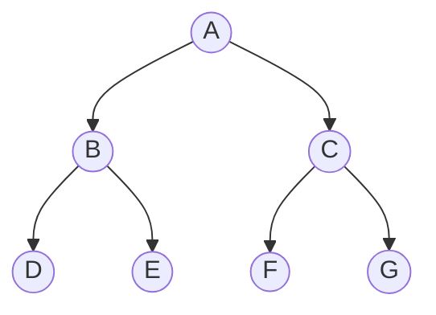
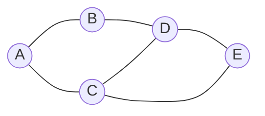
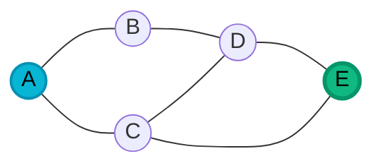
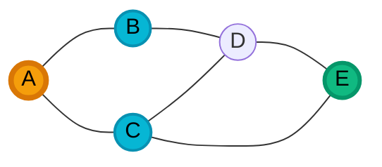
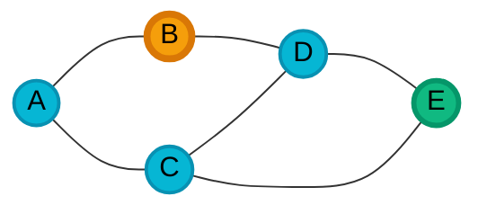
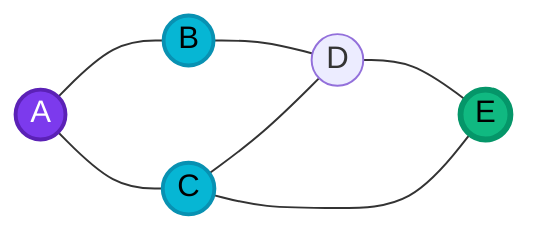
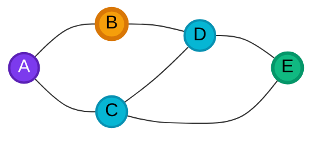
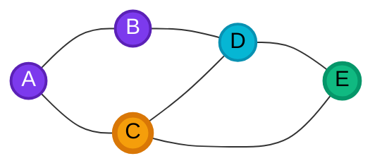
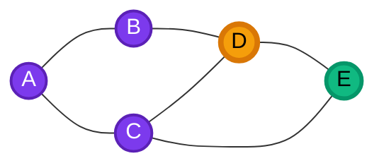
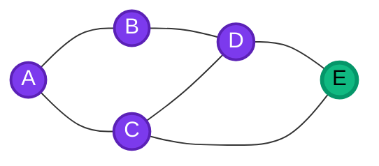

# Search algorithms 

<style>
.to-do-list {
  padding-left: 50px;
}
</style>

> In this lesson, we'll do a brief recap about search algorithms with which we're already familiar (depth-first search and breadth-first search), and use those as a launchpoint to talk about a "smarter" search algorithm called A* search (pronounced "A-star").
>
> This lesson is not quite an _object-oriented programming_ lesson per se. It's definitely very specifically tied to one of the programming projects.

In your previous class (for many of you, CSC 202 _Data Structures_), you learned about the general tree data structure.
A tree is hierarchical data structure, made up of a root node that has zero or more child nodes, each of which is a tree (or a "subtree").

For example, this is a tree:



One of the many operations you can perform in trees is to _search_ for a particular value, using some _search algorithm_.
For example, we may want to find a path from the root of the tree (`A`) to a particular target node (say, `E`).

## The anatomy of a search
Two search algorithms that you may already be familiar with are **depth-first search (DFS)** and **breadth-first search (BFS)**.

A **depth-first search** proceeds by exploring (or "visiting") the root node first, then recursively searching each subtree.
The following animation from Wikipedia illustrates it well:

<figure>

<figcaption>Nodes are numbered by the order in which they would be visited in a depth-first search.<br>
By <a href="//commons.wikimedia.org/w/index.php?title=User:Mre&amp;action=edit&amp;redlink=1" class="new" title="User:Mre (page does not exist)">Mre</a> - <span class="int-own-work" lang="en">Own work</span>, <a href="https://creativecommons.org/licenses/by-sa/3.0" title="Creative Commons Attribution-Share Alike 3.0">CC BY-SA 3.0</a>, <a href="https://commons.wikimedia.org/w/index.php?curid=6342841">Link</a>
</figcaption>
</figure>

In contrast, a **breadth-first search** proceeds by visiting all nodes at a given level (or "depth") before moving on to nodes at the next level.

<figure>

<figcaption>Breadth-first search on a tree structure. First the root is explored, then each node at the next level, then the next level, and so on. Also sometimes known as a "level-order" search.<br>
<a href="https://commons.wikimedia.org/w/index.php?curid=1864649">By Blake Matheny, CC BY-SA 3.0</a>
</figcaption>
</figure>

Both DFS and BFS can be described with the following structure:

* First, know your `startNode` and your `targetNode`.
* Initialize a "to-do list" of nodes that need to be explored during the search. This is also sometimes called the "frontier".
* Add your `startNode` to the "to-do" list—it's the first thing that'll be explored.
* While your to-do list is not empty:
  * Remove the next node from the to-do list.
  * Is it the `targetNode`? If so, you're done!
  * If it's not the `targetNode`, add its children to the to-do list.
  * Run this loop again.
* If you end the loop without having found `targetNode`, then it must not be reachable from `startNode`.

Or, expressed in pseudocode:

```txt
1. | function search(startNode, targetNode) {
2. |  initialize todoList;
3. |  add startNode to todoList;
4. |  while (todoList is not empty) {
5. |    currentNode = remove next node from todoList;
6. |    if (currentNode == targetNode) {
7. |      return "found!";
8. |    }
9. |    add children of currentNode to todoList;
10.|  }
11.|  return "not found";
12.| }
```

The _only_ difference between DFS and BFS is the order in which the "next" node is removed from the to-do list.

That is, on line 5 above, if we remove the most recently-added node from the to-do list, then we're doing a depth-first search (because we go deep into one branch before exploring others).
If we remove the least-recently-added node from the to-do list, then we're doing a breadth-first search (because we explore all nodes at the current depth before going deeper).

> Another way to think about this is: in DFS, the to-do list is a **stack** data structure (last-in, first-out), while in BFS, the to-do list is a **queue** data structure (first-in, first-out).

## Search in a graph

> Searches in graphs require a small but crucial modification to the general search algorithm above.

The steps above are sufficient for searches in _tree_ data structures.
However, in this lesson, we will be focusing on searches in _graph_ data structures.

A **graph** is a set of nodes (also called _vertices_) connected by edges.
There are key differences between trees and graphs.
In graphs,

- there's no fixed "root" node. Typically, a "search" in a graph starts from some arbitrarily chosen `startNode`.
- nodes can be connected in arbitrary ways, as opposed to the hierarchical parent-child relationship seen in trees.

For example, this is a graph, but not a tree:



Crucially, in graphs, there may be _cycles_.
**Cycles** occur when a node is reachable from itself by following a sequence of edges.
In the example above, we can start at `A`, and take a series of edges to get back to `A` again: `A -> B -> D -> C -> A`.

### Activity 

Let's run through our general search algorithm using the graph above.
We'll start from node `A` and try to search for node `E`. 
Let's use BFS.

We'll by marking `E` as our target, and adding `A` to our to-do list, which is a queue (because BFS).

<div style='display: flex'>
<div>



</div>

<div>

- <span style="background-color: #10b981; color: black; border: 1pt #059669 solid;">target</span>
- <span style="background-color: #f59e0b; color: black; border: 1pt #d97706 solid;">current node</span>
- <span style="background-color: #06b6d4; color: black; border: 1pt #0891b2 solid;">to-do list</span> 
<!--- The <span style="background-color: #7c3aed; color: white; border: 1pt #5b21b6 solid;">purple</span> nodes have already been visited.-->
</div>


<div class='to-do-list'>

To-do list (added `A`):

<table>
  <tr>
    <td>&rarr;</td>
    <td>A</td>
    <td>&rarr;</td>
  </tr>
</table>

</div>

</div>


Our next step is to dequeue `A` from the to-do list. It is now our **current** node. It's not our target, so we enqueue its neighbours, `B` and `C`.

<div style='display: flex'>
<div>



</div>

<div>

- <span style="background-color: #10b981; color: black; border: 1pt #059669 solid;">target</span>
- <span style="background-color: #f59e0b; color: black; border: 1pt #d97706 solid;">current node</span>
- <span style="background-color: #06b6d4; color: black; border: 1pt #0891b2 solid;">to-do list</span> 
<!--- The <span style="background-color: #7c3aed; color: white; border: 1pt #5b21b6 solid;">purple</span> nodes have already been visited.-->
</div>

<div class='to-do-list'>

To-do list (removed `A`, added `B` and `C`):

<table>
  <tr>
    <td>&rarr;</td>
    <td>C</td>
    <td>B</td>
    <td>&rarr;</td>
  </tr>
</table>

</div>

</div>

Now, we'll dequeue `B` from the to-do list, because it was "first in", and explore it.
Again, exploring it means _adding its neighbours to the to-do list_.

**At this point, we have a problem**.
When we explore `B`, and try to add its neighbours to our to-do list, we would correctly enqueue `D`. But because `A` is also a neighbour of `B`, we'd end up re-adding `A` to the list!

Even if we didn't re-add `A` now, we would re-add it later when we explore `C`, which is also a neighbour of `A`.

<div style="display: flex">

<div>



</div>

<div>

- <span style="background-color: #10b981; color: black; border: 1pt #059669 solid;">target</span>
- <span style="background-color: #f59e0b; color: black; border: 1pt #d97706 solid;">current node</span>
- <span style="background-color: #06b6d4; color: black; border: 1pt #0891b2 solid;">to-do list</span> 
<!--- The <span style="background-color: #7c3aed; color: white; border: 1pt #5b21b6 solid;">purple</span> nodes have already been visited.-->
</div>

<div class='to-do-list'>

To-do list (removed `B`, added `D` and `A`):

<table>
  <tr>
    <td>&rarr;</td>
    <td>D</td>
    <td>A</td>
    <td>C</td>
    <td>&rarr;</td>
  </tr>
</table>

</div>


</div>

Eventually, this would cause us to re-visit `A`, which in turn would re-add `B` to the to-do list, which would re-add `A`, and so on.
Because of this, our search would just ping-pong between `A` and `B` forever, never reaching our target `E`.

> **To avoid this in a graph with cycles, we need to also keep track of which nodes we've already visited**. Let's revisit our "anatomy of a search" pseudocode. See lines 9 and 10 in our updated pseudocode.

(Note that this assumes a node cannot be its own neighbour.)

```txt
1. | function search(startNode, targetNode) {
2. |  initialize todoList;
3. |  add startNode to todoList;
4. |  while (todoList is not empty) {
5. |    currentNode = remove next node from todoList;
6. |    if (currentNode == targetNode) {
7. |      return "found!";
8. |    }
9. |    add ONLY UNVISITED children of currentNode to todoList;
10.|    mark currentNode as visited;
11.|  }
12.|  return "not found";
13.| }
```

**Here's how our search would progress with this modification.**

<div style='display: flex'>
<div>


</div>

<div>

- <span style="background-color: #10b981; color: black; border: 1pt #059669 solid;">target</span>
- <span style="background-color: #f59e0b; color: black; border: 1pt #d97706 solid;">current node</span>
- <span style="background-color: #06b6d4; color: black; border: 1pt #0891b2 solid;">to-do list</span> 
<!--- The <span style="background-color: #7c3aed; color: white; border: 1pt #5b21b6 solid;">purple</span> nodes have already been visited.-->
</div>

<div class='to-do-list'>

To-do list (added `A`):

<table>
  <tr>
    <td>&rarr;</td>
    <td>A</td>
    <td>&rarr;</td>
  </tr>
</table>

</div>

</div>

Next, we make `A` our current node by dequeing it and enqueing its neighbours:

<div style='display: flex'>
<div>


</div>

<div>

- <span style="background-color: #10b981; color: black; border: 1pt #059669 solid;">target</span>
- <span style="background-color: #f59e0b; color: black; border: 1pt #d97706 solid;">current node</span>
- <span style="background-color: #06b6d4; color: black; border: 1pt #0891b2 solid;">to-do list</span> 
<!--- The <span style="background-color: #7c3aed; color: white; border: 1pt #5b21b6 solid;">purple</span> nodes have already been visited.-->
</div>

<div class='to-do-list'>

To-do list (removed `A`, added `B` and `C`):

<table>
  <tr>
    <td>&rarr;</td>
    <td>C</td>
    <td>B</td>
    <td>&rarr;</td>
  </tr>
</table>

</div>

</div>

**The big addition here is that we now mark `A` as visited before picking up one of its neighbours to search next**.

<div style='display: flex'>
<div>



</div>

<div>

- <span style="background-color: #10b981; color: black; border: 1pt #059669 solid;">target</span>
- <span style="background-color: #f59e0b; color: black; border: 1pt #d97706 solid;">current node</span>
- <span style="background-color: #06b6d4; color: black; border: 1pt #0891b2 solid;">to-do list</span> 
- <span style="background-color: #7c3aed; color: white; border: 1pt #5b21b6 solid;">visited</span>
</div>

<div class='to-do-list'>

To-do list:

<table>
  <tr>
    <td>&rarr;</td>
    <td>C</td>
    <td>B</td>
    <td>&rarr;</td>
  </tr>
</table>

</div>


</div>

We can now proceed to dequeue `B`, explore it, and add its unvisited neighbour `D` to the to-do list (but not `A`, since it's already been visited):

<div style='display: flex'>
<div>



</div>

<div>

- <span style="background-color: #10b981; color: black; border: 1pt #059669 solid;">target</span>
- <span style="background-color: #f59e0b; color: black; border: 1pt #d97706 solid;">current node</span>
- <span style="background-color: #06b6d4; color: black; border: 1pt #0891b2 solid;">to-do list</span> 
- <span style="background-color: #7c3aed; color: white; border: 1pt #5b21b6 solid;">visited</span>
</div>


<div class='to-do-list'>

To-do list (removed `B`; added `D`, _but not_ `A`):

<table>
  <tr>
    <td>&rarr;</td>
    <td>D</td>
    <td>C</td>
    <td>&rarr;</td>
  </tr>
</table>

</div>

</div>

The search can now make forward progress instead of going in circles. Hurray!

We now mark `B` as visited, and pick up `C`, since that's first in our queue.

`C` has three neighbours: `A` (already visited), `D` (in the to-do list already), and `E` (our target!).
We will add only `E` to the to-do list (but we won't change its colour in the graph below—don't want you forgetting that its our target!).

<div style='display: flex'>
<div>



</div>

<div>

- <span style="background-color: #10b981; color: black; border: 1pt #059669 solid;">target</span>
- <span style="background-color: #f59e0b; color: black; border: 1pt #d97706 solid;">current node</span>
- <span style="background-color: #06b6d4; color: black; border: 1pt #0891b2 solid;">to-do list</span> 
- <span style="background-color: #7c3aed; color: white; border: 1pt #5b21b6 solid;">visited</span>
</div>


<div class='to-do-list'>

To-do list (removed `C`; added `E`):

<table>
  <tr>
    <td>&rarr;</td>
    <td>E</td>
    <td>D</td>
    <td>&rarr;</td>
  </tr>
</table>

</div>

</div>

Next, we'll mark `C` as visited, and dequeue `D` from the to-do list.


<div style='display: flex'>
<div>



</div>

<div>

- <span style="background-color: #10b981; color: black; border: 1pt #059669 solid;">target</span>
- <span style="background-color: #f59e0b; color: black; border: 1pt #d97706 solid;">current node</span>
- <span style="background-color: #06b6d4; color: black; border: 1pt #0891b2 solid;">to-do list</span> 
- <span style="background-color: #7c3aed; color: white; border: 1pt #5b21b6 solid;">visited</span>
</div>

<div class='to-do-list'>

To-do list (removed `D`):

<table>
  <tr>
    <td>&rarr;</td>
    <td>E</td>
    <td>&rarr;</td>
  </tr>
</table>

</div>

</div>

`D` has no neighbours that need further action, and the only node left in our to-do list is `E`, which is our target!

We finish by dequeuing `E`, exploring it, and finding that it is indeed our target node.


<div style='display: flex'>
<div>



</div>

<div>

- <span style="background-color: #10b981; color: black; border: 1pt #059669 solid;">target</span>
- <span style="background-color: #f59e0b; color: black; border: 1pt #d97706 solid;">current node</span>
- <span style="background-color: #06b6d4; color: black; border: 1pt #0891b2 solid;">to-do list</span> 
- <span style="background-color: #7c3aed; color: white; border: 1pt #5b21b6 solid;">visited</span>
</div>

<div class='to-do-list'>

To-do list is empty

</div>

</div>

Success!

We've just walked through a breadth-first search in a graph with cycles, using a to-do list (queue) to manage the nodes we have yet to visit, and also some mechanism to track which nodes we've already visited.

> **PONDER**
>
> Here are two questions to think about (and unlike the rest of this chapter, these _are_ software design questions):
>
> * How would you manage visited nodes in an actual implementation of this algorithm?
> * Right now, all we can say is "yes, we found it". But a more useful search function would give back a path from `startNode` to `targetNode`. How would you modify the algorithm to do that? What additional data structures or information would you need to keep track of?

## Some interactive examples

Ok, we have the basic idea of DFS and BFS down.
Let's see what those algorithms look like in a 2-dimensional grid environment.

First, recognise that we can think of the grid as a graph.
Each square in the grid is a node, and each node is connected to its neighbours (up, down, left, right).

<link rel="stylesheet" href="https://cdn.jsdelivr.net/npm/@observablehq/inspector@5/dist/inspector.css">
  
### DFS (Depth-First Search)

The interactive widget below lets you visualize a depth-first search in action in a grid-like environment.
You can use your mouse to drag the start point (green square) and the target point (red square) to different locations on the grid, or click "Shuffle grid" to randomize their locations.

When you're ready, click "Toggle Search" to start the search.

<div id="observablehq-viewof-gridControls-dfs"></div>
<div id="observablehq-instructions-dfs"></div>
<div id="observablehq-grid-dfs"></div>

<script type="module">
import {Runtime, Inspector} from "https://cdn.jsdelivr.net/npm/@observablehq/runtime@5/dist/runtime.js";
import define from "https://api.observablehq.com/@ayaankazerouni/search-algorithm-animations.js?v=4";
new Runtime().module(define, name => {
  if (name === "viewof gridControls") return new Inspector(document.querySelector("#observablehq-viewof-gridControls-dfs"));
  if (name === "instructions") return new Inspector(document.querySelector("#observablehq-instructions-dfs"));
  if (name === "grid") return new Inspector(document.querySelector("#observablehq-grid-dfs"));
  return ["searchPoints"].includes(name);
}).redefine("searchType", "DFS");
</script>


DFS looks...kind of crazy in a grid, because it goes as deep as possible in one direction before backtracking.
It is not very efficient in a grid, because so much depends on the order in which directions are explored.

(In this example, the order is left, up, right, down.)

We're just not gonna talk more about DFS here.

### BFS (Breadth-First Search)

The interactive widget below lets you visualize a breadth-first search in action.

In a tree, BFS looks like a "level-order" search; in a grid, it looks like concentric circles expanding outwards from the start point.

<div id="observablehq-viewof-gridControls-bfs"></div>
<div id="observablehq-instructions-bfs"></div>
<div id="observablehq-grid-bfs"></div>

<script type="module">
import {Runtime, Inspector} from "https://cdn.jsdelivr.net/npm/@observablehq/runtime@5/dist/runtime.js";
import define from "https://api.observablehq.com/@ayaankazerouni/search-algorithm-animations.js?v=4";
new Runtime().module(define, name => {
  if (name === "viewof gridControls") return new Inspector(document.querySelector("#observablehq-viewof-gridControls-bfs"));
  if (name === "instructions") return new Inspector(document.querySelector("#observablehq-instructions-bfs"));
  if (name === "grid") return new Inspector(document.querySelector("#observablehq-grid-bfs"));
  return ["searchPoints"].includes(name);
}).redefine("searchType", "BFS");
</script>

Notice the limitations of BFS in a grid environment: it explores a lot of unnecessary nodes, especially when the start and target points are far apart.

For example, drag the points so that the end node is directly to the right of the start node, a few spaces away.
We can _see_ that the shortest path is a straight line to the right, but BFS still explores all the nodes above and below that line.

That is because BFS naively uses a first-in, first-out queue to explore nodes, without any regard for their actual distance from the target.
We have information about where the target is (its x-y coordinates), but BFS doesn't use it!

## Can we do better?

<div id="observablehq-viewof-gridControls-astar"></div>
<div id="observablehq-instructions-astar"></div>
<div id="observablehq-grid-astar"></div>

<script type="module">
import {Runtime, Inspector} from "https://cdn.jsdelivr.net/npm/@observablehq/runtime@5/dist/runtime.js";
import define from "https://api.observablehq.com/@ayaankazerouni/search-algorithm-animations.js?v=4";
new Runtime().module(define, name => {
  if (name === "viewof gridControls") return new Inspector(document.querySelector("#observablehq-viewof-gridControls-astar"));
  if (name === "instructions") return new Inspector(document.querySelector("#observablehq-instructions-astar"));
  if (name === "grid") return new Inspector(document.querySelector("#observablehq-grid-astar"));
  return ["searchPoints"].includes(name);
}).redefine("searchType", "AStar");
</script>

<small>Credit: animations embedded from <a href="https://observablehq.com/@ayaankazerouni/search-algorithm-animations">this Observable notebook</a>.</small>
