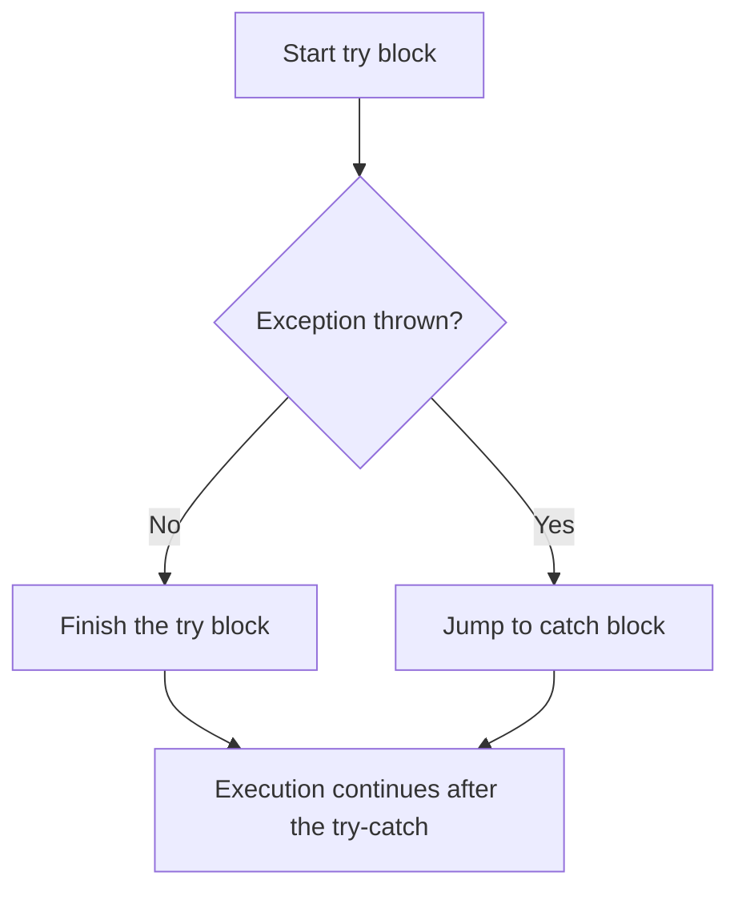

# Exception handling

> _Exceptions_ are unexpected occurrences that disrupt the normal flow of your program. In this lesson we'll learn how we can use Java's Exception handling mechanisms for handling Exceptions.
>
> Here, "handling" an Exception can mean many things:
> - Logging an error, or notifying the user that an action cannot be completed because an error occurred.
> - Performing some work to "recover" from the Exception
> - Letting someone else handle the Exception

<!--Outline

- What an Exception is
- Running example: reading a file
- A sneak peek at the Exception class hierarchy
- Handling an exception: try-catch
- The finally block
- Making it somebody else's problem: throws
- Checked vs unchecked exceptions
- Creating your own exception types
-->
An Exception is...well, it's an _exceptional_ situation that occurs in your program, either because:

- You've encountered a situation you cannot control: for example, your program tried to read a file that does not exist,
- You received input that you did not expect: for example, you expected a String containing a math expression like `23 + 32`, but instead got `"jiminy billy bob"`

In these cases, you (the programmer) need to decide how your program is going to handle those situations.
In programs you wrote in your early classes, you may have decided to not handle them at all, opting simply to assume that your program would not be used in these unexpected ways.

However, as you edge closer toward writing programs that real people will use, you will need to start accounting for these exceptional situations.

## A running example: Reading a file

As always, we'll keep a running example going.

In this case, let's assume we have a file (`runningData.txt`) that contains a list of names and miles run by each person, like so:

```txt
Michael,5.2
Phyllis,3.8
Dwight,3.1
Pam,2.5
Jim,4.0
Oscar,6.3
Stanley,1.2
```

(I did say it was a "running" example.)

And we have some simple Java code that reads the file, line by line, and totals up the total number of miles run.[^1]
Take a moment to read the code below.

[^1]: Since we're just dealing with simple methods here, I won't create classes for this example. Instead, we'll use top-level methods that are supported in Java 25 onward.

```java
// When we run the program, this method will be executed
void main() {
  double totalMiles = getTotalMilesRun("runningData.txt");
  System.out.println("Total miles run: " + totalMiles);
}

// Reads the given file and returns the total number of miles run
// This method contains several potential points of failure!
double getTotalMilesRun(String fileName) {
  // Create a Scanner to read the file
  Scanner fileScanner = new Scanner(new File(fileName));
  double totalMiles = 0.0;

  // Read each line of the file
  while (fileScanner.hasNext()) {
    String line = fileScanner.nextLine();
    String[] parts = line.split(",");
    String name = parts[0];
    double miles = Double.parseDouble(parts[1]);
    totalMiles += miles;
  }

  return totalMiles;
}
```

> **PONDER**
>
> The `getTotalMilesRun` method contains several potential points of failure. _Can you see what they are_?

## File I/O gone wrong

First, the file may not exist, or we may not have permission to read it, or it may be locked by another program, etc.

Any time we read a file, Java _requires us_ to "have a plan" for these exceptional circumstances.
Our program will not compile without such a plan.

**What does that mean in terms of Java code?** The code above will give us a compiler error on the following line:

```java
Scanner fileScanner = new Scanner(new File(fileName));
```

Hovering over the error shows us this message:

```
Unhandled exception: java.io.FileNotFoundException
```

This is telling us that that line of code—the `Scanner` constructor in particular—_might_ throw a `FileNotFoundException`, and if we want to use the `Scanner`, we need to be able to handle that.
The [`Scanner` constructor's documentation](https://docs.oracle.com/en/java/javase/25/docs/api/java.base/java/util/Scanner.html#%3Cinit%3E(java.io.File)) states that it throws a `FileNotFoundException` if the file is not found.[^best]

[^best]: If we can't handle `Scanner` at its worst, do we really deserve it at its best?

So how do we handle it?

We have two options for handling this potential `FileNotFoundException`:

1. We can either handle it ourselves (e.g., by printing a message saying that something went wrong when reading the file), or
2. We can pass the buck to whoever called our method, letting them handle it instead

We'll consider each option in turn.

## Option 1: Handle the exception

Java gives us the `try-catch` construct for handling Exceptions ourselves.
It is used to "try" to do some work that might "throw" an Exception.
And if an Exception is thrown, we can "catch" the Exception and handle it gracefully.

The flow of control in a `try-catch` block is shown below (a code example follows):



Here's an example of its usage:

```java
try {
  // Do some work that could possibly throw an exception.
  Scanner fileScanner = new Scanner(new File(fileName));

  // If we reach here, we know the previous line was successful.
  while (fileScanner.hasNext()) {
    // Read and process each line as before.
  }
} catch (FileNotFoundException fnfe) {
  // Gracefully handle the exception.
  // For example, print a message.
  System.out.println("Could not find a file called " + fileName);

  // You could also print the exception message. The Exception
  // is given to you in the "fnfe" variable.
  System.out.println("Error message: " + fnfe.getMessage());
}

// After the try-catch block, execution continues here.
doMoreStuff();
```

In sum:

- If an Exception occurs partway through the `try` block, execution jumps to the `catch` block. We skip any code in the the `try` block that comes after the offending line.
- After the `catch` block finishes executing, execution continues with the code _after_ the `try-catch` statement.

It can be tempting to think of it as a control flow construct akin to an `if-else` statement, but there are important differences to be aware of.
Importantly, unlike an `if-else` statement, where only one branch is executed, in a `try-catch`, both the `try` block (partially) and the `catch` block (fully) may be executed.

With this knowledge in hand, let's see our method using a `try-catch` block to handle the potential `FileNotFoundException`.

#### `getTotalMilesRun`, with a `try-catch` block

```java
double getTotalMilesRun(String fileName) {
  double totalMiles = 0.0;

  try {
    // Create a Scanner to read the file
    Scanner fileScanner = new Scanner(new File(fileName));

    // Read each line of the file
    while (fileScanner.hasNext()) {
      String line = fileScanner.nextLine();
      String[] parts = line.split(",");
      String name = parts[0];
      double miles = Double.parseDouble(parts[1]);
      totalMiles += miles;
    }
  } catch (FileNotFoundException fnfe) {
    // Gracefully handle the exception
    System.out.println("Could not find a file called " + fileName);
    System.out.println("Error message: " + fnfe.getMessage());
  }

  return totalMiles;
}
```

Now, if we call `getTotalMilesRun` with a file that doesn't exist, our program can gracefully handle it by printing a useful error message.

But what if some _other_ Exception occurs, not specifically a `FileNotFoundException`? Will our `catch` still catch it?

### A brief detour: The Exception type hierarchy

All exception types inherit from the base `Exception` type.
So, a `FileNotFoundException` _is an_ `Exception`.
A `NumberFormatException`—another exception type—_is an_ `Exception`.

So it's possible, but not advisable, to catch all possible Exceptions by simply catching the base `Exception` type, like so:

```java
} catch (Exception e) {
  // This will catch any Exception, including FileNotFoundException,
  // NumberFormatException, etc.
}
```

However, this is considered an antipattern (as in, don't do it).
It's important that our `catch` block catch the correct Exception type, so that error handling can be targeted to the particular thing that went wrong.
If we treat all exceptions the same, we run the risk of not being able to track down the causes of failures if they occur.

#### Handling multiple Exception types

If multiple Exception types are possible from your code, you can have multiple `catch` blocks, like so:

```java
try {
  // Code that might throw multiple exception types
} catch (FileNotFoundException fnfe) {
  // Handle file not found
} catch (NumberFormatException nfe) {
  // Handle number format error
}
```

If an exception occurs, it will be passed to the first `catch` block that matches its type.
Note that the order of the `catch` blocks matters: more specific exceptions should be caught before more general ones.
Java will not automatically map to the "closest matching" `catch` block.

Alternatively, you may want to handle multiple exception types in the same way. For those cases, you can use the pipe (`|`) operator to catch multiple exceptions in a single `catch` block:

```java
try {
  // Code that might throw multiple exception types
  // This catch block would catch FileNotFoundExceptions or NumberFormatExceptions
} catch (FileNotFoundException | NumberFormatException e) {
  // Handle both exceptions the same way
}
```

You should have a good reason to do this, since it can make your error handling and reporting less specific.
That is, these two exceptions may indicate very different problems, and handling them the same way may not be appropriate.
It also shouldn't be used as an escape hatch to avoid writing proper error handling code.

> **NOTE**
>
> An Exception being thrown is _kind of_ like a `return` statement. When an Exception occurs inside a method, execution is interrupted and transferred to the nearest appropriate `catch` block (if it exists), or the Exception "escapes upward" to whoever called the method.
> Because of this, only one Exception can occur at a time in a single `try` block, just like only one `return` statement can be executed at a time in a method.

## Option 2: Make it somebody else's problem

Ok, so we know how to handle an Exception ourselves if it occurs.
But we do have another option: we could make it somebody else's problem using the `throws` keyword.

Instead of handling the exception ourselves, we could pass the buck to whoever called our `getTotalMilesRun` method.
I mean, hey, they are the ones who told us the file name, maybe they have a better idea of what to do if the file doesn't exist.

We can do this by adding a `throws` declaration to our method.

In the method below, we've gone back to our original version of the method (without a `try-catch`), with one small change.
In the method signature, we've added `throws FileNotFoundException`.

This is us telling Java (and anyone who calls this method) that this method _might_ throw a `FileNotFoundException`.

```java
double getTotalMilesRun(String fileName) throws FileNotFoundException {
  // Create a Scanner to read the file
  Scanner fileScanner = new Scanner(new File(fileName));
  double totalMiles = 0.0;

  // Read each line of the file
  while (fileScanner.hasNext()) {
    String line = fileScanner.nextLine();
    String[] parts = line.split(",");
    String name = parts[0];
    double miles = Double.parseDouble(parts[1]);
    totalMiles += miles;
  }

  return totalMiles;
}
```

Now, anyone who calls `getTotalMilesRun` must handle the `FileNotFoundException` themselves (either by using a `try-catch`, or themselves declaring that they themselves would throw it).

This is actually what the `Scanner` constructor did to us!
Take a look at the [constructor's documentation again](https://docs.oracle.com/en/java/javase/25/docs/api/java.base/java/util/Scanner.html#%3Cinit%3E(java.io.File)).
Notice that the constructor has a `throws` declaration.
This caused _us_ to take action to handle the potential `FileNotFoundException`.

That is, if we now have the following  `main` method, _we will have a compiler error on the line where we call `getTotalMilesRun`_, because the Exception is now the `main` method's problem to handle.

```java
void main() {
  double totalMiles = getTotalMilesRun("runningData.txt");
  System.out.println("Total miles run: " + totalMiles);
}
```

Once again, we have two options:

The `main` method could use `try-catch` to handle the exception, like we did in [Option 1](#option-1-handle-the-exception).

Or, the `main` method can _propogate the Exception_ using a `throws` declaration, like we did in [Option 2](#option-2-make-it-somebody-elses-problem).
However, **this is generally a bad idea for `main`**.
There's nowhere else to go! `main` is the entry point of the program—the _user_ is the one who called the method, by virtue of running our program.
So if an Exception "escapes" `main`, the program will simply crash.

## Checked and unchecked exceptions

Remember how I said our `getTotalMilesRun` method has several potential points of failure? We've only handled one of them so far: the possibility that the file doesn't exist.

It was easy to notice that one, because the `Scanner` constructor explicitly told us about it by throwing a `FileNotFoundException`, and the compiler wouldn't move on until we handled it.

These types of exceptions are called _checked exceptions_, because they are checked at compile time.

_Unchecked exceptions_, on the other hand, are not checked at compile time.
Can you tell if there's potential for such an exception to occur in our `getTotalMilesRun` method? If so, what would it be?

## References/Other reading

- Oracle's [Java tutorial on Exceptions](https://docs.oracle.com/javase/tutorial/essential/exceptions/) is excellent.
