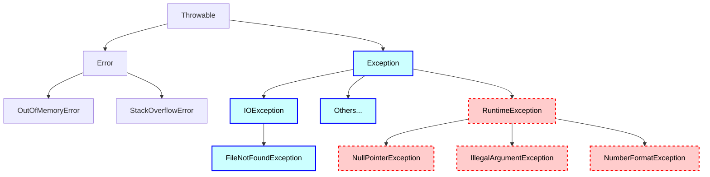

# Checked and unchecked exceptions

> In this lesson, we'll learn about Exceptions that are "checked" or "unchecked" by the compiler and, more broadly, about the Exception hierarchy in Java.

## Recap

Here's one version of the code we left off with in the previous lesson.
We're reading a file, and accounting for the case where the file doesn't exist.

```java
double getTotalMilesRun(String fileName) {
  if (fileName == null || fileName.isEmpty()) {
    throw new IllegalArgumentException("fileName cannot be null or empty");
  }

  double totalMiles = 0.0;

  try {
    // Create a Scanner to read the file
    Scanner fileScanner = new Scanner(new File(fileName));

    // Read each line of the file
    while (fileScanner.hasNext()) {
      String line = fileScanner.nextLine();
      String[] parts = line.split(",");
      String name = parts[0];
      double miles = Double.parseDouble(parts[1]);
      totalMiles += miles;
    }

    // Always a good idea to close the Scanner when we're done with it.
    fileScanner.close();
  } catch (FileNotFoundException fnfe) {
    // Gracefully handle the exception
    System.out.println("Could not find a file called " + fileName);
    System.out.println("Error message: " + fnfe.getMessage());
  }

  return totalMiles;
}
```

We were _forced_ to account for that case by the compiler, because the `Scanner` constructor declares that it `throws` a `FileNotFoundException`.

That's because the `FileNotFoundException` is a _checked_ exception.
The next section discusses the differences between _checked_ and _unchecked_ exceptions and shows some examples.

## The "Throwable" type hierarchy

We saw a brief segment of the Exception type hierarchy in the previous lesson.
Here's a fuller picture, though still not exhaustive.

The top-level `Throwable` type is the root of the exception/error hierarchy in Java.
Its two main subtypes are the `Error` type and the `Exception` type.

`Error` is used for things like `StackOverflowError` (thrown when your program runs out of stack space, usually due to infinite recursion) and `OutOfMemoryError` (throw when, well, when your program is out of memory).
These are usually problems at the JVM level, and you typically don't try to catch or handle them in your code.

We've been mainly concerned with the `Exception` type and its subclasses.



Broadly speaking, exception types that are subclasses of `Exception` but _not_ subclasses of `RuntimeException` are _checked_ by the compiler.
These are represented as <span style="background-color: #ccffff; color: black; border: 1pt #0000ff solid;">blueish</span> nodes in the type hierarchy above.

> _Checked exceptions_ are the ones for which the compiler checks whether or not you have a plan to handle them (i.e., a `try-catch` or a `throws`).

On the other hand, subclasses of `RuntimeExceptions` are _unchecked_ by the compiler.
These are represented as <span style="background-color: #ffcccc; color: black; border: 1pt #ff0000 dashed;">reddish</span> nodes in the type hierarchy above.

> _Unchecked exceptions_ are the ones for which the compiler does not require exception-handling.

For example, before dereferencing an object pointer (i.e., before using the dot operator `.` on the object to access its methods or instance variables), you need to be sure that it's not `null`. If it is `null`, you would get a `NullPointerException`, which is an unchecked exception.

In the previous lesson, we saw an example of checking for null-ness and throwing an `IllegalArgumentException` in the case of invalid. `IllegalArgumentException` is another example of an unchecked exception, commonly used when preconditions are violated (e.g., when a method is called with invalid inputs or "arguments").

### Should you throw checked or unchecked exceptions?

When you're writing a method and want to notify the method caller's about some erroneous conditions, you have a choice: you can throw a checked exception, or you can throw an unchecked exception. Which one should you use?

The conventional wisdom is (courtesy of [Joshua Bloch](https://dn721901.ca.archive.org/0/items/java_20230528/Joshua%20Bloch%20-%20Effective%20Java%20%283rd%29%20-%202018.pdf)):

- **Throw checked exceptions** for cases where the error is recoverable. That is, your method will force the calling method to handle the exception. This is useful for things like reading files, where the caller can do something about the error (e.g., ask the user for a different file name, or create a new file).
- **Throw unchecked exceptions** for things that are likely programmer errors, like passing `null` to a method that asks for an object, or passing a negative number to a method that asks for positive number. These are cases that simply shouldn't happen, and the programmer who gets hit with an unchecked exception should be able to fix the problem by changing _their_ code, rather than you having to write code to handle the exception.[^you]

[^you]: Note that this imagined "other" programmer might well be _you_, working on a different part of the same code base.

## Handling potential unchecked exceptions

So, if the compiler doesn't require you to handle unchecked exceptions, does that mean you can ignore them? Absolutely not!

Unchecked exceptions can still crash your program if they "escape containment", so you need to either make sure they won't occur (e.g., because you've checked preconditions), or you need to handle them with a `try-catch` block if they do occur.

How do we know _which_ unchecked Exceptions might occur in our code?
Some good practices are:

- **Be defensive** about any data you're working with that comes from an external source, like a file, method parameter, or a returned value from a method you don't control.
- **Check for null-ness** before dereferencing an object pointer, especially if the object came to you from an external source. This is a sub-category of the point above, but is quite common so it bears mentioning.
  - Because `NullPointerExceptions` are such a common failure mode, Java also contains the [`Optional<T>`](https://docs.oracle.com/en/java/javase/25/docs/api/java.base/java/util/Optional.html) type.[^generics] If you're writing a method that might return `null` in certain conditions (e.g., a failed search in a data structure), you should consider returning an `Optional` instead. That way, a "client" (or "user") of your method will be forced to check for the presence of the value before using it.
- **Read the documentation** for methods you're using from external libraries. They will (or they _should_, at any rate) document the exceptions they will throw and under what conditions.
  - The corollary to this is: if _you're_ throwing Exceptions in your own code, or returning exceptional values like `null`, make sure to document them clearly.

### Is our method safe yet?

All right, with all that background: is our `getTotalMilesRun` method safe from unchecked exceptions?

Let's go through the method line-by-line.
It may seem a bit tedious, but it's a good habit to get into.
An escaped Exception can crash your program, the consequences of which can be simply inconvenient (e.g., a user has to restart the program), catastrophic (e.g., a user loses data), or even dangerous (e.g., a user gets injured because of a software failure in a medical device).
As an example of that last, [there have been multiple casualties or life-threatening events as the result of faults or exceptions in blood glucose monitoring devices or insulin pumps](https://www.consumerreports.org/health/diabetes/when-diabetes-devices-fail-a2408992822/).

What "external" data, methods, or constructors are we using? We go through the method's components line-by-line, and I've **bolded** the items we're gonna need to handle.

- `fileName` might be `null` or empty. We've handled that already.
- `new Scanner(...)`:  We've handled the checked `FileNotFoundException` that's throwable by this constructor. No other exceptions are documented by the `Scanner` constructor, so we're good here.
- [`fileScanner.nextLine()`](https://docs.oracle.com/en/java/javase/25/docs/api/java.base/java/util/Scanner.html#nextLine()): Gets the next line. The documentation declares two possible throwable exceptions:
  - `NoSuchElementException`: Thrown if there _isn't_ a next line. In this case we're okay because always we're checking `hasNext()` before calling it.
  - **`IllegalStateException`: Thrown if the scanner is "closed". Let's file that away as something we need to handle!**
- We're reading a `line` from the file, and `split`ting it around a comma. This should be fine: the `nextLine` method wouldn't give us a `null` value back.
- `parts[0]` and `Double.parseDouble(parts[1])`: Accesses the first and second element from the split pieces, and parses the second element into a `double`. These two lines are rife with potential program crashes!
  - **`parts[0]`: Do we _know_ there'll be a `parts[0]`?** If the line is empty, this would result in an `ArrayIndexOutOfBoundsException`, an unchecked exception.
  - `Double.parseDouble(parts[1])`: This one's a double-whammy.
    - **Do we _know_ there'll be a `parts[1]`?**
    - **If there _is_ a `parts[1]`, what if it isn't a numeric value like `32.2`, and is instead, like, a banana?** This would result in a `NumberFormatException`, another unchecked exception.


Essentially, our program is happy with a well-formed data file like this:

```txt
Michael,5.2
Phyllis,3.8
Dwight,3.1
Pam,2.5
Jim,4.0
Oscar,6.3
Stanley,1.2
```

But we have no error handling for malformed data files like this:

```txt
Fun Run for the Cure

Michael,5.2
Phyllis,3.8
Dwight,3.1

Angela,missing

Pam,2.5
Jim,4.0

Daryl,three

Oscar,6.3
Stanley,1.2
```

Ok, so our TO-DO list is:

1. Handle the possibility of an `ArrayIndexOutOfBoundsException` from trying to access `parts[0]` or `parts[1]` when the line is empty or doesn't contain a comma.
2. Handle the possibility of a `NumberFormatException` from trying to parse a non-numeric value with `Double.parseDouble`.
3. Handle the possibility of an `IllegalStateException` from the `Scanner` constructor.

### Ask for permission, not forgiveness

How should we handle those potential failure points? Should we just go full-speed-ahead and wrap the whole method body in a `try-catch` block that catches all of those exceptions, handling them only if they occur?

Or should we check if our data is valid _before_ using it?

In Java, the conventional wisdom is to **"ask for permission, not forgiveness"**: that is, check for the conditions that would cause an exception before you use the data, rather than just trying to use it and catching the exception if it occurs.

> Exceptions are, as their name implies, to be used only for exceptional conditions; they should never be used for ordinary control flow.
>
> Joshua Bloch. [_Effective Java_, Chapter 10: Exceptions](https://dn721901.ca.archive.org/0/items/java_20230528/Joshua%20Bloch%20-%20Effective%20Java%20%283rd%29%20-%202018.pdf)

However, parsing strings into numeric values is almost the only exception (hah) to this rule: the Java standard library does not provide methods to check if a `String` is parse-able into a number.
We could roll our own, but it could be error prone, and anyway, the `Double.parseDouble` method already does this check.
So we would end up doing the check twice.

Ok, all that said, here's our code where we're handling items #1 and #2 from our TO-DO list.

```java
double getTotalMilesRun(String fileName) {
  if (fileName == null || fileName.isEmpty()) {
    throw new IllegalArgumentException("fileName cannot be null or empty");
  }

  double totalMiles = 0.0;

  try {
    // Create a Scanner to read the file
    Scanner fileScanner = new Scanner(new File(fileName));

    while (fileScanner.hasNext()) {
      String line = fileScanner.nextLine();
      String[] parts = line.split(",");

      // Ask permission: Check if the line is valid before proceeding
      if (parts.length < 2) {
        System.out.println("Invalid line: " + line);
        continue; // skip this line and move on to the next one
      }

      String name = parts[0];
      double miles;

      // Ask forgiveness: try to parse the double, and recover from the
      //  Exception if needed.
      try {
        miles = Double.parseDouble(parts[1]);
      } catch (NumberFormatException nfe) {
        System.out.println("Invalid miles value: " + parts[1]);
        continue; // skip this line and move on to the next one
      }

      totalMiles += miles;
    }

    // Always a good idea to close the Scanner when we're done with it.
    fileScanner.close();
  } catch (FileNotFoundException fnfe) {
    System.out.println("Could not find a file called " + fileName);
    System.out.println("Error message: " + fnfe.getMessage());
  }

  return totalMiles;
}
```

It's really important to do _something_ when handling an exception—there are few things worse in software development than silent software failures.
For now, we're simply printing an error message and skipping invalid lines.
In a real project, you might do something else, depending on requirements.

For example, the [`read_csv` function in the `pandas` library](https://pandas.pydata.org/pandas-docs/stable/reference/api/pandas.read_csv.html) will raise an error by default if it encounters malformed lines while reading a file, but also lets the user decide if they want some different response to malformed lines.

**On to item #3 from our TO-DO list!**
We see that the `Scanner` constructor might throw an `IllegalStateException` if the `Scanner` is "closed". What does that mean?

Well, when we use a `Scanner` to read a file, we're obtaining a resource (i.e., a file handle) from the operating system.
When we're done with that resource, we need to "close" it, which tells the operating system that we're done with it and that it can be freed up for other uses.

In the code above, we're doing this with the `fileScanner.close()` method call. After we've closed the `Scanner`, it can no longer be used to read lines from the file.

In our case, we are clearly closing the `Scanner` _after_ using it to read lines.
So, in terms of the `IllegalStateException` from the `Scanner` constructor, we're okay.

With that, we've addressed our TO-DO list of items.

**Does that mean that nothing can possibly go wrong with our `getTotalMilesRun` method?** Of course not! The file might be locked by another process, or it might be on a network drive that has gone offline, or it might have so many records that our `totalMiles` variable overflows, or ... ... ...

The point is, you can never be sure that your code is 100% safe from exceptions, but you can do your best to handle the ones you know about, and to check for conditions that might cause exceptions before they occur.

In this case, we've done a fairly good job being defensive about the data we're working with, and we've handled the exceptions that we know about.

**However, there's one last thing to consider.**
If something unforeseen _does_ go wrong while reading the file, an exception would occur and jump to the `catch` block, or escape the method.
Either way, _we're going to be stuck with an open `Scanner`_, because we wouldn't reach the `fileScanner.close()` method call in these scenarios.
This will leave us with an open file handle, which can lead to resource leaks and other problems.

Can we make sure that our `Scanner` _always_ closes, **no matter what**?

The `finally` block, discussed in the next lesson, can be used for this purpose.

## Optional additional reading about error handling

Different languages, communities, and teams have differing views about exceptions.

- For example, Google's style guide for C++ [recommends against the use of exceptions](https://google.github.io/styleguide/cppguide.html#Exceptions).
- Google's [Java style guide](https://google.github.io/styleguide/javaguide.html#s6.2-caught-exceptions) makes no such recommendation, and cautions against ignoring caught exceptions.
- The Rust language [does not have exceptions at all](https://doc.rust-lang.org/book/ch09-00-error-handling.html), and instead uses other language constructs to deal with "recoverable" and "unrecoverable" errors.
- The article [_Everything wrong with exceptions_](https://mortoray.com/everything-wrong-with-exceptions/), despite its title, gives a fairly balanced view of the pros and cons of exceptions as an error-handling mechanism.

[^generics]: If you are not sure what the `<T>` means here, please see the notes about _generics_ or _type parameters_ in the [lesson on lambdas](../15_lambdas).
