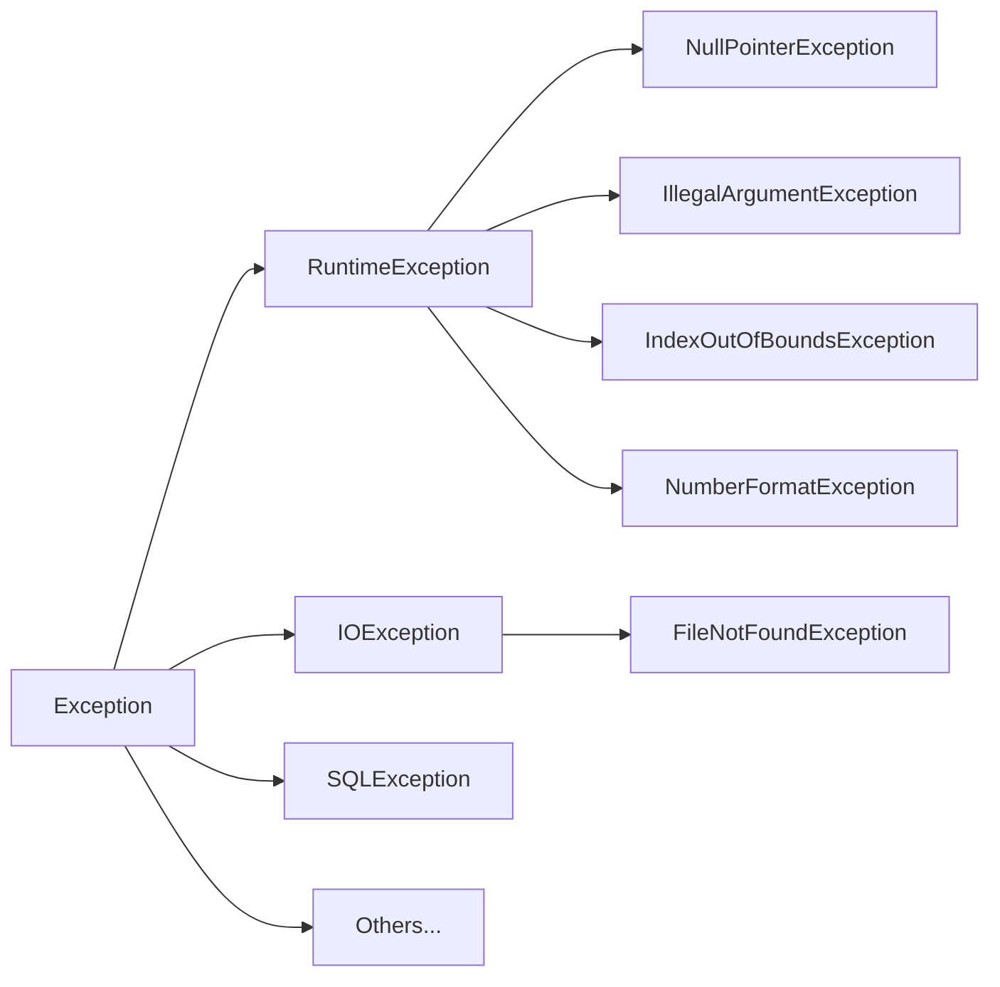

# Checked and unchecked exceptions

> In this lesson, we'll learn about Exceptions that are "checked" or "unchecked" by the compiler, and more broadly, about the Exception hierarchy in Java.

## Recap

Here's one version of the code we left off with in the previous lesson.
We're reading a file, and accounting for the case where the file doesn't exist.

We were _forced_ to account for that case by the compiler, because the `Scanner` constructor declares that it `throws` a `FileNotFoundException`.

```java
double getTotalMilesRun(String fileName) {
  double totalMiles = 0.0;

  try {
    // Create a Scanner to read the file
    Scanner fileScanner = new Scanner(new File(fileName));

    // Read each line of the file
    while (fileScanner.hasNext()) {
      String line = fileScanner.nextLine();
      String[] parts = line.split(",");
      String name = parts[0];
      double miles = Double.parseDouble(parts[1]);
      totalMiles += miles;
    }
  } catch (FileNotFoundException fnfe) {
    // Gracefully handle the exception
    System.out.println("Could not find a file called " + fileName);
    System.out.println("Error message: " + fnfe.getMessage());
  }

  return totalMiles;
}
```

## The Java Exception Type Hierarchy

Here's an excerpt of the Java Exception type hierarchy (drawn from left-to-right so the font doesn't shrink too much).



Classes that are subclasses of `Exception` but not subclasses of `RuntimeException` are _checked_ by the compiler.
If you call a method that declares that it `throws` a checked exception, you must either handle that exception with a `try-catch` block, or declare that your method also `throws` that exception (e.g., the way we handled the `FileNotFoundException` in the previous lesson).

On the other hand, subclasses of `RuntimeExceptions` are _unchecked_ by the compiler.
They can still occur during runtime and crash the program!
So, for example, before dereferencing an object pointer, you should still check that it's not `null` to avoid a `NullPointerException`.
It's just that the compiler won't force you to handle that case.
