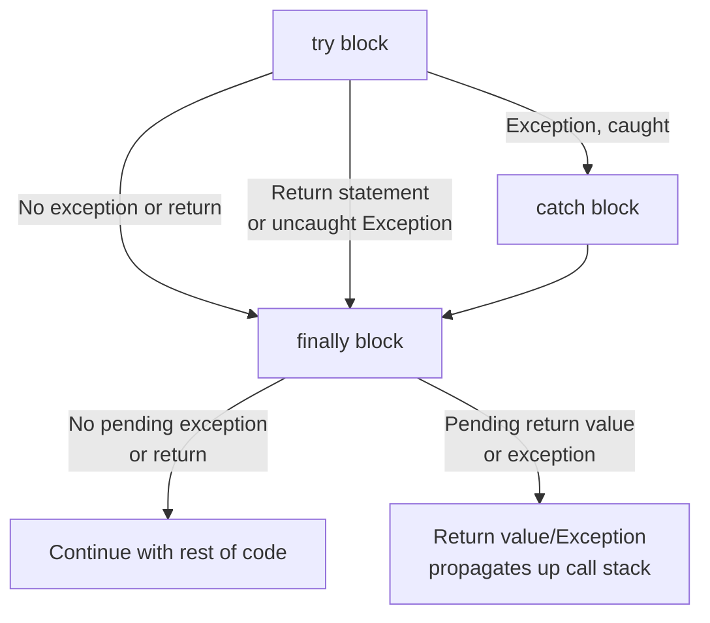

# finally

> The `finally` keyword is used to define a block of code that will be executed after a `try-catch` block, regardless of whether an exception occurred or was caught. It is useful for cleaning up resources, like closing files or releasing locks, that need to be done regardless of the outcome of the `try-catch` block.

In the previous lesson, we ended with the following `getTotalMilesRun` method. It's pretty good, but it has one problem: if something goes wrong while reading the file, we'll skip reading the rest of the file and throw an Exception, **_and we would skip closing the `Scanner`_**.

We can ensure that we _always_ hit the `fileScanner.close()` line by enclosing it in a `finally` block.
This requires relatively minor changes to our method.
I've marked the new parts with comments in the code below.

```java
double getTotalMilesRun(String fileName) {
  if (fileName == null || fileName.isEmpty()) {
    throw new IllegalArgumentException("fileName cannot be null or empty");
  }

  // NEW: We need to declare the Scanner in a broader scope
  // so it's accessible in the finally block.
  Scanner fileScanner = null;

  double totalMiles = 0.0;

  try {
    fileScanner = new Scanner(new File(fileName));

    while (fileScanner.hasNext()) {
      String line = fileScanner.nextLine();
      String[] parts = line.split(",");

      if (parts.length < 2) {
        System.out.println("Invalid line: " + line);
        continue;
      }

      String name = parts[0];
      double miles;

      try {
        miles = Double.parseDouble(parts[1]);
      } catch (NumberFormatException nfe) {
        System.out.println("Invalid miles value: " + parts[1]);
        continue;
      }

      totalMiles += miles;
    }
  } catch (FileNotFoundException fnfe) {
    System.out.println("Could not find a file called " + fileName);
    System.out.println("Error message: " + fnfe.getMessage());
  } finally {
    // This will be executed no matter what
    if (fileScanner != null) {
      fileScanner.close();
    }
  }

  return totalMiles;
}
```

### All roads lead to finally

Let's update our mental mode of the flow of control with `try-catch` blocks by adding a `finally` block.



Notice how we reach the `finally` block _no matter what_.
Every path through the `try-catch` block goes through `finally`.

- If the `try` block goes through without a hitch, we'll go through `finally` before continuing with the code after the `try-catch-finally` block.
- If the `try` block encounters an exception,
  - If that exception is handled in a `catch` block, we'll go through the `catch` block and then through the `finally` block, before continuing with the code after the `try-catch-finally` block.
  - If that exceptoin is _not_ handled by any `catch` block, we'll _still_ go through `finally` before throwing the Exception up the call stack to the method that called us
- If a `try` or `catch` block `return` a value, we'll _still_ go through `finally` before exiting the method.

## try-with-resources

The pattern we're seeing above—declaring a resource (like a `Scanner`) outside the `try` block, initializing it inside `try`, and then closing it in `finally`—is a common idiom in Java.

Java therefore introduced a newer syntax called "try-with-resources" that takes care of closing your resources for you.

> You should always use the try-with-resources syntax when working with resources that need to be closed, like `Scanner`, `FileReader`, `BufferedReader`, `InputStream`, `OutputStream`, etc.

We can therefore re-write our method as follows (and I promise this is its final form):

```java
double getTotalMilesRun(String fileName) {
  if (fileName == null || fileName.isEmpty()) {
    throw new IllegalArgumentException("fileName cannot be null or empty");
  }

  double totalMiles = 0.0;

  // NEW: Use try-with-resources to automatically close the Scanner
  // The fileScanner variable is only visible inside the try block
  try (Scanner fileScanner = new Scanner(new File(fileName))) {
    while (fileScanner.hasNext()) {
      String line = fileScanner.nextLine();
      String[] parts = line.split(",");

      if (parts.length < 2) {
        System.out.println("Invalid line: " + line);
        continue;
      }

      String name = parts[0];
      double miles;

      try {
        miles = Double.parseDouble(parts[1]);
      } catch (NumberFormatException nfe) {
        System.out.println("Invalid miles value: " + parts[1]);
        continue;
      }

      totalMiles += miles;
    }
  } catch (FileNotFoundException fnfe) {
    System.out.println("Could not find a file called " + fileName);
    System.out.println("Error message: " + fnfe.getMessage());
  }

  return totalMiles;
}
```
